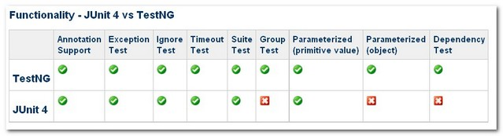

# Hello Spring #

## Spring概述 ##

Spring框架带来好处

Spring框架结构

Spring子项目

## 快速入门 ##

MySQL ENGINE=InnoDB(支持事务)

领域模型中的实体类可细分为4种类型：VO/DTO/DO/PO

@Repository 通过Spring注解定义一个DAO

@Autowired 自动注入

SpringJDBC 对传统的JDBC API进行薄层封装

在DAO中编写SQL语句时，通常将SQL语句写在类静态变量中

@Service 服务层的Bean

	<?xml version="1.0" encoding="UTF-8" ?>
	<beans ...>
	    
	    <!-- 扫描类包，将标注Spring注解的类自动转化Bean，同时完成Bean的注入 -->
	    <context:component-scan base-package="com.smart.dao"/>
	    <context:component-scan base-package="com.smart.service"/>
	    
	    <!-- 配置数据源 -->
		<bean id="dataSource" class="org.apache.commons.dbcp.BasicDataSource"
			destroy-method="close" 
			p:driverClassName="com.mysql.jdbc.Driver"
			p:url="jdbc:mysql://localhost:3306/sampledb"
			p:username="root"
			p:password="123" />
	
		<!-- 配置Jdbc模板  -->
		<bean id="jdbcTemplate" class="org.springframework.jdbc.core.JdbcTemplate"
			p:dataSource-ref="dataSource" />
			
		<!-- 配置事务管理器 -->
		<bean id="transactionManager"
			class="org.springframework.jdbc.datasource.DataSourceTransactionManager"
			p:dataSource-ref="dataSource" />
			
		<!-- 通过AOP配置提供事务增强，让service包下所有Bean的所有方法拥有事务 -->
		<aop:config proxy-target-class="true">
			<aop:pointcut id="serviceMethod"
				expression="(execution(* com.smart.service..*(..))) and (@annotation(org.springframework.transaction.annotation.Transactional))" />
			<aop:advisor pointcut-ref="serviceMethod" advice-ref="txAdvice" />
		</aop:config>
		<tx:advice id="txAdvice" transaction-manager="transactionManager">
			<tx:attributes>
				<tx:method name="*" />
			</tx:attributes>
		</tx:advice>
	</beans>

---

TestNG VS JUnit

---

SpringMVC

web.xml

	<web-app>
	
		<context-param>
			<param-name>contextConfigLocation</param-name>
			<param-value>classpath:smart-context.xml</param-value>
		</context-param>

		<!--启动Spring容器的监听器-->
		<listener>
			<listener-class>
				org.springframework.web.context.ContextLoaderListener
			</listener-class>
		</listener>
	
		<!-- Spring MVC地址映射-->
		<servlet>
			<servlet-name>smart</servlet-name>
			<servlet-class>
				org.springframework.web.servlet.DispatcherServlet
			</servlet-class>
			<load-on-startup>3</load-on-startup>
		</servlet>
	
	</web-app>

SpringMVC约定servlet

/WEB-INF下，有<Servlet name>-servlet.xml的形式

@Controller 标注成一个Spring

smart-servlet.xml配置文件

	<beans ...>
		<!-- 扫描web包，应用Spring的注解 -->
		<context:component-scan base-package="com.smart.web"/>
		
		<!-- 配置视图解析器，将ModelAndView及字符串解析为具体的页面 -->
		<bean
			class="org.springframework.web.servlet.view.InternalResourceViewResolver"
			p:viewClass="org.springframework.web.servlet.view.JstlView" 
			p:prefix="/WEB-INF/jsp/"<!--前缀-->
			p:suffix=".jsp" /><!--后缀-->
	
	</beans>

---

pom.xml需要有的

    <plugin>
        <groupId>org.mortbay.jetty</groupId>
        <artifactId>maven-jetty-plugin</artifactId>
        <version>6.1.25</version>
        <configuration>
            <connectors>
                <connector implementation="org.mortbay.jetty.nio.SelectChannelConnector">
                    <port>8000</port>
                    <maxIdleTime>60000</maxIdleTime>
                </connector>
            </connectors>
            <contextPath>/bbs</contextPath>
            <scanIntervalSeconds>0</scanIntervalSeconds>
        </configuration>
    </plugin>

运行jetty maven jetty:run

