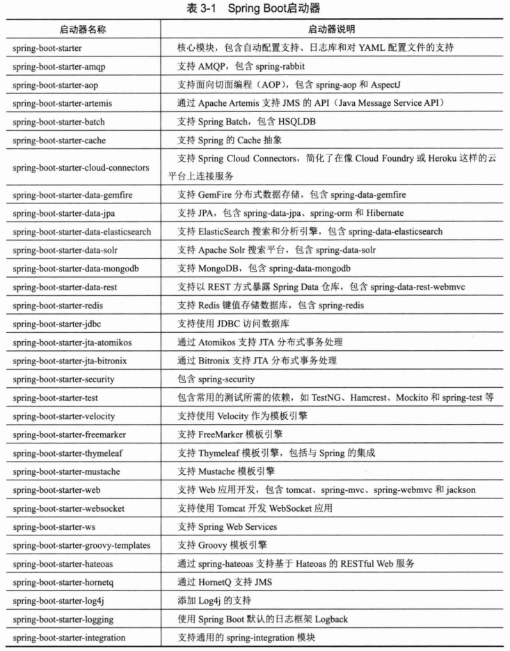
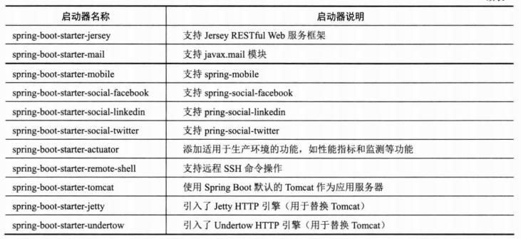

# Spring Boot #

Spring Boot特点

- 为开发者提供Spring快速入门体验
- 内嵌Tomcat和Jetty容器，无需部署WAR文件到Web容器就可独立运行应用
- 提供许多基于Maven的pom配置模板来简化工程配置
- 提供实现**自动化**配置的基础设施
- 提供可直接在生产环境中使用的功能，如性能指标、应用信息和应用健康检查
- 开箱即用，没有代码生成，也无需XML配置文件，支持修改默认值来满足特定需求

Spring是由一系列启动器组成的，这些启动器构成一个强大的，灵活的开发助手。开发人员根据项目需要，选择并组合相应的启动器，就可以快速搭建一个适合项目需要的基础运行框架

基于Maven和Gradle

基于Spring Boot CLI环境配置
 基于命令行

@EnableTransactionManagerment注解开启事务支持，相当于XML<tx:annotation-driven/>允许@Transactional

	<project ...>
	    <parent>
	        <groupId>org.springframework.boot</groupId>
	        <artifactId>spring-boot-starter-parent</artifactId>
	        <version>1.3.3.RELEASE</version>
	    </parent>
	    <modelVersion>4.0.0</modelVersion>
	    <artifactId>HelloSpringBoot</artifactId>
	    <name>Spring4.x第三章实例</name>
	    <packaging>war</packaging>
	    <dependencies>
	    
	    	<!-- Boot Web启动器 -->
	        <dependency>
	            <groupId>org.springframework.boot</groupId>
	            <artifactId>spring-boot-starter-web</artifactId>
	        </dependency>
	
			<!-- 连接数据库 -->
	        <dependency>
	            <groupId>org.springframework.boot</groupId>
	            <artifactId>spring-boot-starter-jdbc</artifactId>
	        </dependency>
	        <dependency>
	            <groupId>mysql</groupId>
	            <artifactId>mysql-connector-java</artifactId>
	            <version>${mysql.version}</version>
	        </dependency>
	
			<!-- 监控功能 -->
	        <dependency>
	            <groupId>org.springframework.boot</groupId>
	            <artifactId>spring-boot-starter-actuator</artifactId>
	        </dependency>
	        
	        <!-- Spring MVC -->
	        <dependency>
	            <groupId>org.apache.tomcat.embed</groupId>
	            <artifactId>tomcat-embed-jasper</artifactId>
	            <scope>provided</scope>
	        </dependency>
	        <dependency>
	            <groupId>javax.servlet</groupId>
	            <artifactId>jstl</artifactId>
	        </dependency>
	        
	        <dependency>
	            <groupId>org.springframework.boot</groupId>
	            <artifactId>spring-boot-starter-test</artifactId>
	            <scope>test</scope>
	        </dependency>
	        
	    </dependencies>
	    <build>
	        <plugins>
	            <plugin>
	                <groupId>org.springframework.boot</groupId>
	                <artifactId>spring-boot-maven-plugin</artifactId>
	            </plugin>
	            <plugin>
	                <groupId>org.apache.maven.plugins</groupId>
	                <artifactId>maven-surefire-plugin</artifactId>
	                <configuration>
	                    <useSystemClassLoader>false</useSystemClassLoader>
	                </configuration>
	            </plugin>
	            <plugin>
	                <groupId>org.apache.maven.plugins</groupId>
	                <artifactId>maven-compiler-plugin</artifactId>
	                <version>2.3.2</version>
	                <configuration>
	                    <source>1.8</source>
	                    <target>1.8</target>
	                </configuration>
	            </plugin>
	            
	        </plugins>
	    </build>
	</project>

