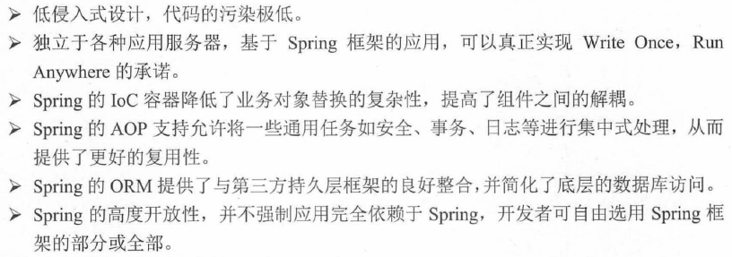
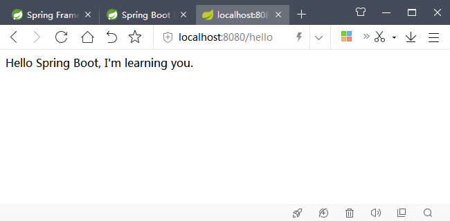

# 入门 #

## 简介 ##

Spring具有以下优点：

---

Spring组成结构图[Link](https://docs.spring.io/spring/docs/4.3.24.RELEASE/spring-framework-reference/htmlsingle/#overview-modules)：

---

Spring Boot解决的问题：

Spring Boot提供了针对企业应用开发各种场景的很多spring-boot-starter自动配置依赖模块。

spring-boot-starter的有多种配置方式：

---

日志依赖模块spring-boot-starter-logging

Web开发依赖模块spring-boot-starter-web

[更多依赖模块](https://docs.spring.io/spring-boot/docs/2.0.5.RELEASE/reference/htmlsingle/#using-boot-starter)

## HelloWorld ##

创建Maven项目

常用项目模型：

- maven-archetype-quickstart（非Web项目）
- maven-archetype-webapp（Web项目）

---

Maven全局使用JDK8

	<profiles>
	    <profile>   
		    <id>jdk-1.8</id>    
		    <activation>   
		        <activeByDefault>true</activeByDefault>    
		        <jdk>1.8</jdk>   
		    </activation>    
		    <properties>   
		        <maven.compiler.source>1.8</maven.compiler.source>    
		        <maven.compiler.target>1.8</maven.compiler.target>    
		        <maven.compiler.compilerVersion>1.8</maven.compiler.compilerVersion>  
		    </properties>   
		</profile>
	</profiles>

---

修改pom.xml，引用Spring Boot

	<project ...>

		...

		<parent>
			<groupId>org.springframework.boot</groupId>
			<artifactId>spring-boot-starter-parent</artifactId>
			<version>2.0.0.RELEASE</version>
		</parent>

		...

	</project>

在`<dependencies>`添加需要的模块

	<dependency>
		<groupId>org.springframework.boot</groupId>
		<artifactId>spring-boot-starter-web</artifactId>
	</dependency>

---

编写测试代码

	@RestController
	public class HelloController {
		
		@RequestMapping("/hello")
		public String hello() {
			return "Hello Spring Boot, I'm learning you.";
		}
	
	}

main启动类：

	@SpringBootApplication
	public class App {
		
	    public static void main( String[] args ) {
	    	
	        SpringApplication.run(App.class, args);
	        
	    }
	}

浏览器输入

[http://localhost:8080/hello](#)

## 小结 ##

Spring Boot可以不用或者只需很少的Spring配置就可以让企业项目快速开发运行。

