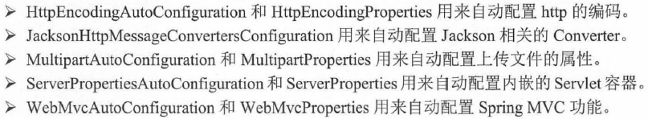

# Spring Boot的Web开发 #

[1.Spring Boot的Web开发支持](#spring-boot的web开发支持)

[2.Thymeleaf模板引擎](#thymeleaf模板引擎)

[2.1.Thymeleaf基础语法](#thymeleaf基础语法)

[2.1.1.引入Thymeleaf](#引入thymeleaf)

[2.1.2.引入URL](#引入url)

[2.1.3.表达式](#表达式)

[2.1.4.字符串操作](#字符串操作)

[2.1.5.运算符](#运算符)

[2.1.6.条件判断](#条件判断)

[2.1.7.循环](#循环)

[2.1.8.内置对象](#内置对象)

[3.Spring和Thymeleaf的整合](#spring和thymeleaf的整合)

[4.Spring Boot 的Web开发实例](#spring-boot-的web开发实例)

[4.1.示例：Thymeleaf常用功能](#示例thymeleaf常用功能)

[5.Spring Boot对于JSP的支持](#spring-boot对于jsp的支持)

[6.Spring Boot处理JSON数据](#spring-boot处理json数据)

[7.Spring Boot文件上传下载](#spring-boot文件上传下载)

[7.1.示例：Spring Boot文件上传](#示例spring-boot文件上传)

[7.2.示例：使用对象方式接受上传文件](#示例使用对象方式接受上传文件)

[7.3.示例：文件下载](#示例文件下载)

[8.Spring Boot的异常处理](#spring-boot的异常处理)

[8.1.示例：ExceptionHandler处理异常](#示例exceptionhandler处理异常)

[8.2.示例：父类Controller处理异常](#示例父类controller处理异常)

[8.3.示例：Advice处理异常返回JSON](#示例advice处理异常返回json)

## Spring Boot的Web开发支持 ##

使用spring-boot-starter-web为Web开发提供支持

与Web相关的自动配置支持保存spring-boot-autoconfigure.jar的`org.springframework.boot.autoconfigure.web`下

重要的自动配置支持如下：

## Thymeleaf模板引擎 ##

[Thymeleaf 文档](https://www.thymeleaf.org/doc/tutorials/3.0/usingthymeleaf.pdf)

[Thymeleaf 交互指南](http://itutorial.thymeleaf.org/)

Thymeleaf被Spring Boot官方推荐使用Thymeleaf完全替代JSP

	<!-- 添加spring-boot-starter-thymeleaf模块依赖 -->
	<dependency>
		<groupId>org.springframework.boot</groupId>
		<artifactId>spring-boot-starter-thymeleaf</artifactId>
	</dependency>

### Thymeleaf基础语法 ###

#### 引入Thymeleaf ####

	<html xmlns:th="http://www.thymeleaf.org">

#### 引入URL ####

	<link rel="stylesheet" th:href="@{css/bootstrap-theme.min.css}"/> 
	

	<a th:href="@{regexptest?loginName=jack&amp;password=123456}">测试表达式访问数据</a>  
	<a th:href="@{iftest}">测试条件判断</a>  
	<a th:href="@{eachtest}">测试循环</a>  

#### 表达式 ####

${x}将返回存储在Thymeleaf上下文中的变量x或作为请求Request作用范围域中的属性。

	

${param.x}将返回一个名为x的请求参数

	

${session.x}将返回一个名为x的会话HttpSession作用范围域中的属性。

	

${application.x}将返回一个名为x的全局ServletContext上下文作用范围域中的属性。

	

#### 字符串操作 ####

- String concatenation: +
- Literal substitutions: |The name is ${name}|

	th:src="@{'img/'+${book.image}}"
	th:src="|The name is ${name}|"

#### 运算符 ####

Comparators: > , < , >= , <= ( gt , lt , ge , le )
Equality operators: == , != ( eq , ne )

	username不为空

#### 条件判断 ####

th:if, th:unless

	age不为空
	
	address为空

th:switch

	

	  
管理员

	  
来宾

	  
其他

	

#### 循环 ####

	<tbody class="text-center">
		<tr th:each="book : ${books}">
			<td> </td>
			<td th:text="${book.title}">书名</td>
			<td th:text="${book.author}">作者</td>
			<td th:text="${book.price}">价格</td>
		</tr>
	</tbody>

#### 内置对象 ####

可能常用的

- \#dates
- \#string
- \#arrays
- \#maps
- ...

	${#dates.format(date, 'dd/MMM/yyyy HH:mm')}
	${#dates.arrayFormat(datesArray, 'dd/MMM/yyyy HH:mm')}
	${#dates.listFormat(datesList, 'dd/MMM/yyyy HH:mm')}
	${#dates.setFormat(datesSet, 'dd/MMM/yyyy HH:mm')}

	${#strings.isEmpty(name)}
	${#strings.arrayIsEmpty(nameArr)}
	${#strings.listIsEmpty(nameList)}
	${#strings.setIsEmpty(nameSet)}

## Spring和Thymeleaf的整合 ##

自动配置类在spring-boot-autoconfigure-2.0.0.RELEASE.jar的`org.springframework.boot.autoconfigure.thymeleaf`

`ThymeleafProperties`类中设置Thymeleaf的默认设置，项目总可以通过application.properties对默认设置进行修改

## Spring Boot 的Web开发实例 ##

	<!-- 添加spring-boot-starter-thymeleaf模块依赖 -->
	<dependency>
	    <groupId>org.springframework.boot</groupId>
	    <artifactId>spring-boot-starter-thymeleaf</artifactId>
	</dependency>

[用户登录](logintest/src/main/resources/templates/index.html)

[应用页面](logintest/src/main/resources/templates/main.html)

[Controller的具体实现](logintest/src/main/java/org/fkit/logintest/controller)

### 示例：Thymeleaf常用功能 ###

[应用入口](thymeleaftest/src/main/resources/templates/index.html)

[Controller的具体实现](thymeleaftest/src/main/java/org/fkit/thymeleaftest/controller/IndexController.java)

## Spring Boot对于JSP的支持 ##

[pom.xml](jsptest/pom.xml)

[配置文件](jsptest/src/main/resources/application.properties)

[Controller的具体实现](jsptest/src/main/java/org/fkit/jsptest/controller)

[JSP文件](jsptest/src/main/webapp/WEB-INF/jsp/index.jsp)

---

//Done! TODO:查找src/main/resources 中state和template文件是否为thymeleaf要求

相关文档解决上面的问题，是Spring Boot要求的

[Static Content](https://docs.spring.io/spring-boot/docs/2.0.5.RELEASE/reference/htmlsingle/#boot-features-webflux-static-content)

[Template Engines](https://docs.spring.io/spring-boot/docs/2.0.5.RELEASE/reference/htmlsingle/#boot-features-spring-mvc-template-engines)

## Spring Boot处理JSON数据 ##

[Controller具体实现](jsontest/src/main/java/org/fkit/jsontest/controller)

[JSON数据展现1](jsontest/src/main/resources/templates/index.html)

[JSON数据展现2](jsontest/src/main/resources/templates/getjson.html)

## Spring Boot文件上传下载 ##

### 示例：Spring Boot文件上传 ###

Apache Commons FileUpload组件依赖，由于不属于Spirng Boot，所以需要加上版本 

		<dependency>
		  <groupId>commons-fileupload</groupId>
		  <artifactId>commons-fileupload</artifactId>
		  <version>1.3.3</version>
		</dependency>

[上传文件操作页面](fileuploadtest/src/main/resources/templates/index.html)

负责上传文件的表单和一般表单有一些区别，表单的编码类型必须是multipart/form-data，即`<post enctype="multipart/form-data >"`

[上传文件大小设置](fileuploadtest/src/main/resources/application.properties)

[Controller的具体实现#upload](fileuploadtest/src/main/java/org/fkit/fileuploadtest/controller/FileUploadController.java)

### 示例：使用对象方式接受上传文件 ###

上传的文件会作为对象的属性保存。

	public class User implements Serializable{

		private String username;
		// 对应上传的headPortrait，类型为MultipartFile，上传文件会自动绑定到image属性当中
		private MultipartFile headPortrait;

[User](fileuploadtest/src/main/java/org/fkit/fileuploadtest/domain/User.java)

[上传文件操作页面](fileuploadtest/src/main/resources/templates/registerForm.html)

[Controller的具体实现#register](fileuploadtest/src/main/java/org/fkit/fileuploadtest/controller/FileUploadController.java)

[上传文件成功页面](fileuploadtest/src/main/resources/templates/userInfo.html)

### 示例：文件下载 ###

[下载操作页面](fileuploadtest/src/main/resources/templates/userInfo.html)

[Controller的具体实现#download](fileuploadtest/src/main/java/org/fkit/fileuploadtest/controller/FileUploadController.java)

## Spring Boot的异常处理 ##

### 示例：ExceptionHandler处理异常 ###

[入口](exceptiontest/src/main/resources/templates/index.html)

使用`@ExceptionHandler(value = Exception.class)`处理异常

[TestController](/exceptiontest/src/main/java/org/fkit/exceptiontest/controller/TestController.java)

导向异常的页面是系统默认的。

### 示例：父类Controller处理异常 ###

[父类BaseController](exceptiontest/src/main/java/org/fkit/exceptiontest/controller/BaseController.java)内有`@ExceptionHandler(value = Exception.class)`处理异常

[继承BaseController的UserController](exceptiontest/src/main/java/org/fkit/exceptiontest/controller/UserController.java)就不用再定义ExceptionHandler

[导向异常的页面](exceptiontest/src/main/resources/templates/error.html)

### 示例：Advice处理异常返回JSON ###

`@ControllerAdvice`注解的类时当前项目中所有类的统一异常处理类，`@ExceptionHandler`注解的方法用来定义函数针对的异常类型以及异常如何处理，**不用在每个Controller中逐一定义异常处理方法**。

定义处理全局异常处理器。

[全局异常处理并以JSON返回](exceptiontest/src/main/java/org/fkit/exceptiontest/exception/GlobalExceptionHandler.java)
