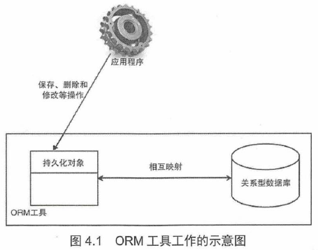
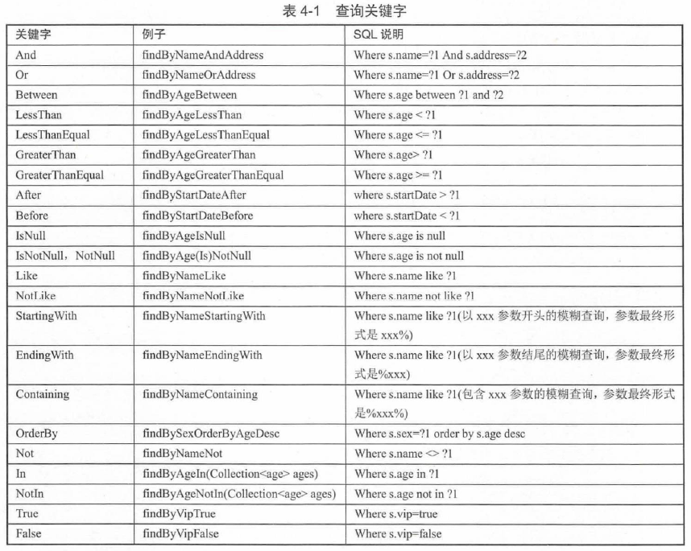
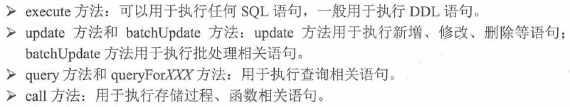

# Spring Boot的数据访问 #

[1.JPA/Hibernate/Spring Date JPA概念](#jpahibernatespring-date-jpa概念)

[2.Spring Data JPA](#spring-data-jpa)

[2.1.Spring Data 核心数据访问接口](#spring-data-核心数据访问接口)

[2.2.示例：CrudRepository接口访问数据](#示例crudrepository接口访问数据)

[2.3.示例：PagingAndSortingRepository接口访问数据](#示例pagingandsortingrepository接口访问数据)

[2.4.Spring Data JPA开发](#spring-data-jpa开发)

[2.5.示例：简单条件查询](#示例简单条件查询)

[2.6.示例：关联查询和@Query查询](#示例关联查询和@query查询)

[2.7.示例：@NamedQuery查询](#示例@namedquery查询)

[2.8.示例：Specification查询](#示例specification查询)

[3.Spring Boot使用JdbcTemplate](#spring-boot使用jdbctemplate)

[3.1.示例：JdbcTemplate访问数据](#示例jdbctemplate访问数据)

[4.Spring Boot整合MyBatis](#spring-boot整合mybatis)

[4.1.示例：Spring Boot整合MyBatis开发](#示例spring-boot整合mybatis开发)

## JPA/Hibernate/Spring Date JPA概念 ##

ORM的全称是Object/Relation Mapping

当ORM框架完成映射后，程序员即可以利用OOP的简单易用性，又可以利用RDB的技术优势。

基本映射方式

1. 数据表映射类
2. 数据表的行映射对象（即实例）
3. 数据表的列（字段）映射对象的属性

流行的ORM框架简介

1. Hibernate
2. JPA
3. Spring Data JPA

## Spring Data JPA ##

### Spring Data 核心数据访问接口 ###

Spring Data JPA是Spring Data 下的一个模块，想了解一下Spring Data核心数据访问接口。

	package org.springframework.data.repository;

	public interface Repository<T, ID> {
	
	}

---

	package org.springframework.data.repository;

	public interface CrudRepository<T, ID> extends Repository<T, ID> {
	
		<S extends T> S save(S entity);
	
		<S extends T> Iterable<S> saveAll(Iterable<S> entities);
	
		Optional<T> findById(ID id);
	
		boolean existsById(ID id);
	
		Iterable<T> findAll();
	
		Iterable<T> findAllById(Iterable<ID> ids);
	
		long count();
	
		void deleteById(ID id);
	
		void delete(T entity);
	
		void deleteAll(Iterable<? extends T> entities);
	
		void deleteAll();
	}

### 示例：CrudRepository接口访问数据 ###

增加依赖

	<!-- 添加MySQL依赖 -->
	<dependency>
		<groupId>mysql</groupId>
		<artifactId>mysql-connector-java</artifactId>
	</dependency>

	<!-- 添加Spring Data JPA依赖 -->
	<dependency>
		<groupId>org.springframework.boot</groupId>
		<artifactId>spring-boot-starter-data-jpa</artifactId>
	</dependency>

---

[数据库连接等配置信息](crudrepositorytest/src/main/resources/application.properties)

---

[创建持久化类User](crudrepositorytest/src/main/java/org/fkit/crudrepositorytest/bean/User.java)

---

[定义数据访问层接口](crudrepositorytest/src/main/java/org/fkit/crudrepositorytest/repository/UserRepository.java)

	public interface UserRepository extends CrudRepository<User, Integer>{
		//这里故意留白
	}

>PS.好精简啊

---

[定义业务层类](crudrepositorytest/src/main/java/org/fkit/crudrepositorytest/service/UserService.java)

---

[定义控制类](crudrepositorytest/src/main/java/org/fkit/crudrepositorytest/controller/UserController.java)

---

创建数据库

	CREATE DATABASE springdatajpa;

数据库表会由应用创建

---

运行应用

1. http://127.0.0.1:8080/user/save 增
2. http://127.0.0.1:8080/user/update 改
3. http://127.0.0.1:8080/user/getAll 查
4. http://127.0.0.1:8080/user/delete 删

### 示例：PagingAndSortingRepository接口访问数据 ###

PagingAndSortingRepository继承CrudRepository接口，并另外新增了排序和分页查询功能

	package org.springframework.data.repository;

	public interface PagingAndSortingRepository<T, ID> extends CrudRepository<T, ID> {
	
		Iterable<T> findAll(Sort sort);
	
		Page<T> findAll(Pageable pageable);
	}

[pom.xml](pagingandsortingrepositorytest/pom.xml)同上例基本雷同

[application.properties](pagingandsortingrepositorytest/src/main/resources/application.properties)同上例基本雷同

[持久化类Article](pagingandsortingrepositorytest/src/main/java/org/fkit/pagingandsortingrepositorytest/bean/Article.java)

---

[定义数据访问层接口](pagingandsortingrepositorytest/src/main/java/org/fkit/pagingandsortingrepositorytest/repository/ArticleRepository.java)

---

[定义业务层类](pagingandsortingrepositorytest/src/main/java/org/fkit/pagingandsortingrepositorytest/service/ArticleService.java)

---

[定义控制器类](pagingandsortingrepositorytest/src/main/java/org/fkit/pagingandsortingrepositorytest/controller/ArticleController.java)

---

[为数据库插入数据](pagingandsortingrepositorytest/scripts/db.sql)

---

运行应用

1. http://127.0.0.1:8080/article/sort 查询全部
2. http://127.0.0.1:8080/article/page/1 查询分页

### Spring Data JPA开发 ###

JpaRepository是实现Spring Data JPA技术访问数据库的关键接口。

	public interface JpaRepository<T, ID> extends PagingAndSortingRepository<T, ID>, QueryByExampleExecutor<T> {
	
		List<T> findAll();
	
		List<T> findAll(Sort sort);
	
		List<T> findAllById(Iterable<ID> ids);
	
		<S extends T> List<S> saveAll(Iterable<S> entities);
	
		void flush();
	
		<S extends T> S saveAndFlush(S entity);
	
		void deleteInBatch(Iterable<T> entities);
	
		void deleteAllInBatch();
	
		T getOne(ID id);
	
		@Override
		<S extends T> List<S> findAll(Example<S> example);
	
		@Override
		<S extends T> List<S> findAll(Example<S> example, Sort sort);
	}

### 示例：简单条件查询 ###

[示例目录](simplespringdatajpatest/src/main/java/org/fkit/simplespringdatajpatest)

pom.xml、application.properties基本同以前的雷同

[持久化类Student](simplespringdatajpatest/src/main/java/org/fkit/simplespringdatajpatest/bean/Student.java)

[DAO](simplespringdatajpatest/src/main/java/org/fkit/simplespringdatajpatest/repository/StudentRepository.java)

Spring Data JPA中可以直接通过在数据访问层定义方法名称即可进行数据的访问操作。

[Service层](simplespringdatajpatest/src/main/java/org/fkit/simplespringdatajpatest/service/StudentService.java)

[Controller层](simplespringdatajpatest/src/main/java/org/fkit/simplespringdatajpatest/controller/StudentController.java)

运行应用

1. http://localhost:8080/student/save 增
2. http://localhost:8080/student/name?name=孙悟空 查
3. http://localhost:8080/student/nameAndAddress?name=蜘蛛精&address=广州 查
4. http://localhost:8080/student/nameLike?name=魔王 查

### 示例：关联查询和@Query查询 ###

[示例目录](springdatajpaquerytest/src/main/java/org/fkit/springdatajpaquerytest)

创建数据库

	CREATE DATABASE springdatajpaquery;

pom.xml、application.propertise基本同上例雷同。

[创建PO-Student](springdatajpaquerytest/src/main/java/org/fkit/springdatajpaquerytest/bean/Student.java)

[创建PO-Clazz](springdatajpaquerytest/src/main/java/org/fkit/springdatajpaquerytest/bean/Clazz.java)

---

[创建DAO-Student](springdatajpaquerytest/src/main/java/org/fkit/springdatajpaquerytest/repository/StudentRepository.java)

[创建DAO-Clazz](springdatajpaquerytest/src/main/java/org/fkit/springdatajpaquerytest/repository/ClazzRepository.java)

上面两个类都实现JpaRepository接口。

@Query注解中可以直接定义JPQL语句进行数据的访问操作。

[创建Service](springdatajpaquerytest/src/main/java/org/fkit/springdatajpaquerytest/service/SchoolService.java)

[创建Controller](springdatajpaquerytest/src/main/java/org/fkit/springdatajpaquerytest/controller/StudentController.java)

---

运行应用

1. http://127.0.0.1:8080/student/save 增
2. http://127.0.0.1:8080/student/getClazzStus?clazzName=疯狂java开发1班 查
3. http://127.0.0.1:8080/student/findNameAndSexByClazzName?clazzName=疯狂java开发1班 查
4. http://127.0.0.1:8080/student/findNameByClazzNameAndSex?clazzName=疯狂java开发1班&sex=女 查
5. http://127.0.0.1:8080/student/deleteStuByStuName?stuName=牛魔王 查

### 示例：@NamedQuery查询 ###

Spring Data JPA 支持使用JPA的NameQuery定义查询操作，即一个名称映射一个查询语句

pom.xml、application.propertise基本同上例雷同。

@NamedQuery用在PO上

[创建PO](springdatajpanamequerytest/src/main/java/org/fkit/springdatajpanamequerytest/bean/Student.java)

	@Entity
	@Table(name="tb_student")
	// 查询班级下的学生信息//findStudentsByClazzName在DAO内
	@NamedQuery(name="Student.findStudentsByClazzName"
			,query="select s from Student s where s.clazz.name = ?1")
	public class Student implements Serializable{
		//...
	}

	//最后解析成
	//select student0_.id as id1_1_, student0_.address as address2_1_, student0_.age as age3_1_, student0_.clazz_id as clazz_id6_1_, student0_.name as name4_1_, student0_.sex as sex5_1_ from tb_student student0_ cross join tb_clazz clazz1_ where student0_.clazz_id=clazz1_.code and clazz1_.name=?

[创建DAO](springdatajpanamequerytest/src/main/java/org/fkit/springdatajpanamequerytest/repository/StudentRepository.java)

[创建Service](springdatajpanamequerytest/src/main/java/org/fkit/springdatajpanamequerytest/service/ShcoolService.java)

[创建Controller](springdatajpanamequerytest/src/main/java/org/fkit/springdatajpanamequerytest/controller/StudentController.java)

---

运行应用

1. http://127.0.0.1:8080/student/save 增
2. http://127.0.0.1:8080/student/getClazzStus?clazzName=疯狂java开发1班

### 示例：Specification查询 ###

JPA允许基于Criteria对象进行按条件查询，而Spring Data JPA提供了一个Specification接口，这接口封装了JPA的Criteria查询条件，从而可以通过此接口更加方便地使用Criteria查询。

创建新数据库

	CREATE DATABASE springdatajpaspecification;

pom.xml、application.propertise基本同上例雷同。

[创建PO](springdatajpaspecificationtest/src/main/java/org/fkit/springdatajpaspecificationtest/bean)

[创建DAO](springdatajpaspecificationtest/src/main/java/org/fkit/springdatajpaspecificationtest/repository), 里面DAO实现Specification接口。

[页面数据对象VO](springdatajpaspecificationtest/src/main/java/org/fkit/springdatajpaspecificationtest/vo/PageData.java)

[创建Service](springdatajpaspecificationtest/src/main/java/org/fkit/springdatajpaspecificationtest/service/ShcoolService.java)内操作Criteria对象

[创建Controller](springdatajpaspecificationtest/src/main/java/org/fkit/springdatajpaspecificationtest/controller/StudentController.java)

---

运行应用

1. http://127.0.0.1:8080/student/save 增
2. http://127.0.0.1:8080/student/getStusBySex?sex=女 查
3. http://127.0.0.1:8080/student/getStusByDynamic?clazz.name=疯狂java开发1班&sex=女 查
4. http://127.0.0.1:8080/student/getStusByDynamic?address=广州&sex=男
5. http://127.0.0.1:8080/student/getStusByPage?clazzName=疯狂java开发1班&pageIndex=1&pageSize=2 分页查
6. http://127.0.0.1:8080/student/getStusByPage?clazzName=疯狂java开发1班&pageIndex=2&pageSize=2 分页查第二页

## Spring Boot使用JdbcTemplate ##

### 示例：JdbcTemplate访问数据 ###

JdbcTemplate对象是Spring封装JDBC的核心对象，常用的方法如下：

	CREATE DATABASE jdbctemplate;

	use jdbctemplate;

	CREATE TABLE tb_user(
		id INT PRIMARY KEY AUTO_INCREMENT,
		login_name varchar(23),
		password varchar(23),
		username varchar(23)
	);

引入核心依赖配置

	<!-- 添加JDBC依赖 -->
	<dependency>
		<groupId>org.springframework.boot</groupId>
		<artifactId>spring-boot-starter-jdbc</artifactId>
	</dependency>

[配置文件](springbootjdbctemplate/src/main/resources/application.properties)

[创建PO](springbootjdbctemplate/src/main/java/org/fkit/springbootjdbctemplate/bean/User.java) 

[创建DAO](springbootjdbctemplate/src/main/java/org/fkit/springbootjdbctemplate/repository/UserRepository.java)，JdbcTemplate在此被用

[创建Service](springbootjdbctemplate/src/main/java/org/fkit/springbootjdbctemplate/service/UserService.java)

[创建Controller](springbootjdbctemplate/src/main/java/org/fkit/springbootjdbctemplate/controller/UserController.java)

---

运行应用

1. http://127.0.0.1:8080/user/insertUser 增
2. http://127.0.0.1:8080/user/insertGetKey?loginName=x1&username=徐磊&password=123456 增
3. http://127.0.0.1:8080/user/findAll 查

## Spring Boot整合MyBatis ##

### 示例：Spring Boot整合MyBatis开发 ###

创建数据库

	create database springbootmybatis；

	use springbootmybatis;

	CREATE TABLE `tb_user` (
	  `id` int(11) NOT NULL AUTO_INCREMENT,
	  `login_name` varchar(23) DEFAULT NULL,
	  `password` varchar(23) DEFAULT NULL,
	  `username` varchar(23) DEFAULT NULL,
	  PRIMARY KEY (`id`)
	)

引入依赖

	<!-- 添加MyBatis依赖 -->
	<dependency>
		<groupId>org.mybatis.spring.boot</groupId>
		<artifactId>mybatis-spring-boot-starter</artifactId>
		<version>1.3.1</version>
	</dependency>

[配置文件](springbootmybatistest/src/main/resources/application.properties)

[创建PO](springbootmybatistest/src/main/java/org/fkit/springbootmybatistest/bean/User.java)

[创建DAO](springbootmybatistest/src/main/java/org/fkit/springbootmybatistest/controller/UserController.java)MyBatis在此用到

[创建Service](springbootmybatistest/src/main/java/org/fkit/springbootmybatistest/service/UserService.java)

[创建Controller](springbootmybatistest/src/main/java/org/fkit/springbootmybatistest/controller/UserController.java)

由于历史问题，需要额外的中间件来使MyBatis和Spring整合

	@SpringBootApplication
	// 扫描数据访问层接口的包名。
	@MapperScan("org.fkit.springbootmybatistest.repository") 
	public class App {
		public static void main(String[] args) {
			SpringApplication.run(App.class, args);
		}
	}

---

运用应用

1. http://127.0.0.1:8080/user/insertUser?loginName=swk&userName=孙悟空&password=123456 增
2. http://127.0.0.1:8080/user/insertGetKey?loginName=xl&userName=孙悟空&password=123456 增
3. http://127.0.0.1:8080/user/findAll 查

