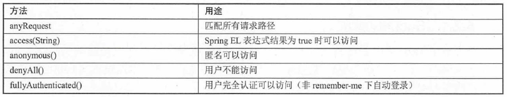
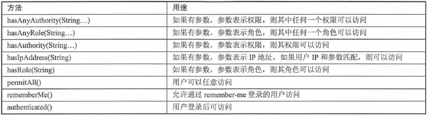

# Spring Boot的Security安全控制 #

[1.Spring Security是什么](#spring-security是什么)

[2.Spring Security入门](#spring-security入门)

[2.1.Security适配器](#security适配器)

[2.2.用户认证](#用户认证)

[2.3.用户授权](#用户授权)

[2.4.Spring Security核心类](#spring-security核心类)

[2.5.Spring Security的验证机制](#spring-security的验证机制)

[2.6.Spring Boot的支持](#spring-boot的支持)

[2.7.示例：简单Spring Boot Security应用](#示例简单spring-boot-security应用)

[3.企业项目中的Spring Security操作](#企业项目中的spring-security操作)

[3.1.示例：基于JPA的Spring Boot Security操作](#示例基于jpa的spring-boot-security操作)

[3.2.示例：基于MyBatis的Spring Boot Security操作](#示例基于mybatis的spring-boot-security操作)

[3.3.示例：基于JDBC的Spring Boot Security操作](#示例基于jdbc的spring-boot-security操作)

## Spring Security是什么 ##

它是一个能够为基于Spring的企业应用系统提供安全访问控制解决方案的安全框架。它提供了一组可以在Spring应用上下文配置的Bean，充分利用了Spring IoC和AOP功能，为应用系统提供安全访问控制功能，减少为企业系统安全控制编写大量重复代码的工作。

安全框架主要包括两个操作：

- 认证Authtication：确认用户可以访问当前系统
- 授权Authorization：确认用户在当前系统中是否能够执行某个操作，即用户所有的功能权限。

## Spring Security入门 ##

### Security适配器 ###

在Spring Boot当中配置Spring Security非常简单，创建一个自定义继承WebSecurityConfigurerAdapter，并重写config方法来配置锁需要的安全配置。

[使用示例](securitytest/src/main/java/org/fkit/securitytest/security/AppSecurityConfigurer.java)

### 用户认证 ###

	/**
	 * 用户认证操作
	 * */
    @Autowired
    public void configureGlobal(AuthenticationManagerBuilder auth) throws Exception {
    	System.out.println("AppSecurityConfigurer configureGlobal() 调用......");
    	// spring-security 5.0 之后需要密码编码器，否则会抛出异常：There is no PasswordEncoder mapped for the id "null"
    	auth.inMemoryAuthentication().passwordEncoder(new MyPasswordEncoder()).withUser("fkit").password("123456").roles("USER");

       auth.inMemoryAuthentication().passwordEncoder(new MyPasswordEncoder()).withUser("admin").password("admin").roles("ADMIN","DBA");
		//创建用户，密码，角色

    }

### 用户授权 ###

	/**
	 * 用户授权操作 
	 * */
	@Override
    protected void configure(HttpSecurity http) throws Exception {
		System.out.println("AppSecurityConfigurer configure() HttpSecurity 调用......");
		http.authorizeRequests()
		// spring-security 5.0 之后需要过滤静态资源
		.antMatchers("/login","/css/**","/js/**","/img/*").permitAll() 
	  	.antMatchers("/", "/home").hasRole("USER")
	  	.antMatchers("/admin/**").hasAnyRole("ADMIN", "DBA")
	  	.anyRequest().authenticated()
	  	.and()
	  	.formLogin().loginPage("/login").successHandler(appAuthenticationSuccessHandler)
	  	.usernameParameter("loginName").passwordParameter("password")
	  	.and()
	  	.logout().permitAll()
	  	.and()
	  	.exceptionHandling().accessDeniedPage("/accessDenied");
    }

- antMatchers使用Ant风格匹配路径
- regexMatchers使用正则表达式匹配路径

更多安全处理方法：

### Spring Security核心类 ###

- Authentication 表示用户认证信息
- SecurityContextHolder 保存SecurityContext的。SecurityContext中含有当前所访问系统的用户的详细信息。SecurityContext使用一个Authentication的对象来描述当前用户的相关信息。
- UserDetails 定义了一些可以获取用户名、密码、权限等与认证相关的信息方法。存放在Authentication。
- UserDatailsService 
- GrantedAuthority
- DaoAuthenticationProvider
- PasswordEncoder

### Spring Security的验证机制 ###

Spring Security大体上是由一堆Filter实现，Filter会在SpringMVC前拦截请求

### Spring Boot的支持 ###

Spring Boot针对Spring Security 提供了自动配置的功能，这些默认的自动配置极大地简化开发工作

可通过配置文件进行设置

### 示例：简单Spring Boot Security应用 ###

引入依赖

	<!-- 添加spring-boot-starter-security 依赖 -->
	<dependency>
		<groupId>org.springframework.boot</groupId>
		<artifactId>spring-boot-starter-security</artifactId>
	</dependency>

[登陆页面](securitytest/src/main/resources/templates/login.html)

[角色ROLE_USER用户登陆之后显示页面](securitytest/src/main/resources/templates/home.html)

[角色ROLE_ADMIN用户登陆之后显示的页面](securitytest/src/main/resources/templates/admin.html)

[角色DBA页面](securitytest/src/main/resources/templates/dba.html)

[拒绝页面](securitytest/src/main/resources/templates/accessDenied.html)

---

[认证处理类](securitytest/src/main/java/org/fkit/securitytest/security/AppSecurityConfigurer.java)

[创建认证成功处理类](securitytest/src/main/java/org/fkit/securitytest/security/AppAuthenticationSuccessHandler.java)

[创建Controller](securitytest/src/main/java/org/fkit/securitytest/controller/AppController.java)

---

运行应用

1. 登录localhost:8080的"/","/login","home","admin"会重定向localhost:8080/login，没有登录，就没有权限。
2. USER角色登录只允许ADMIN角色登录的页面，会跳转到accessDenied.html页面。反之，亦然。

## 企业项目中的Spring Security操作 ##

### 示例：基于JPA的Spring Boot Security操作 ###

[测试页面跟上例雷同](securityjpatest/src/main/resources/templates)

[用户PO](securityjpatest/src/main/java/org/fkit/securityjpatest/pojo/FKUser.java)

[角色po](securityjpatest/src/main/java/org/fkit/securityjpatest/pojo/FKRole.java)

[创建用户DAO](securityjpatest/src/main/java/org/fkit/securityjpatest/repository/UserRepository.java)

[创建用户Service](securityjpatest/src/main/java/org/fkit/securityjpatest/service/UserService.java) 实现UserDetailsService接口，数据库的用户信息转换成Spring Security内用户信息

[认证处理类](securityjpatest/src/main/java/org/fkit/securityjpatest/security/AppSecurityConfigurer.java) 用userService注入AuthenticationProvider

[导入测试数据](securityjpatest/src/main/resources/db.sql)

运行结果基本同上例相同。

### 示例：基于MyBatis的Spring Boot Security操作 ###

源码与上例大部分相同[Source Code](securitymybatistest/src/main/java/org/fkit/securitymybatistest)

[创建DAO](securitymybatistest/src/main/java/org/fkit/securitymybatistest/mapper/UserMapper.java)

运行结果基本同上例相同。

### 示例：基于JDBC的Spring Boot Security操作 ###

源码与上例大部分相同[Source Code](securityjdbctest/src/main/java/org/fkit/securityjdbctest)

[创建DAO](securityjdbctest/src/main/java/org/fkit/securityjdbctest/repository/UserRepository.java)

运行结果基本同上例相同。
