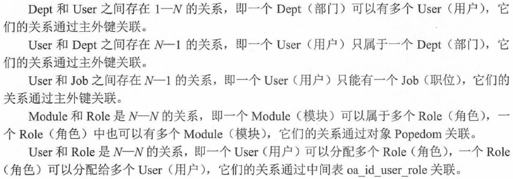

# 实战项目：信息管理系统 #

## 项目简介及系统架构 ##

信息管理系统是办公信息自动化建设当中最常见的项目。

### 系统功能介绍 ###

### 系统结构 ###

采用Java EE应用结构

1. 表现层 JSP
2. 控制层 SpringMVC
3. 业务层 Spring IoC容器管理的业务逻辑组件
4. 持久层 6个DAO
5. 领域对象层 6个Domain Object
6. 数据库 MySQL

### 系统的功能模块 ###

1. 用户管理
2. 菜单管理
3. 角色管理

系统以业务逻辑组件作为Repository组件的门面，封装这些Repository组件，业务逻辑组件底层依赖于这些Repository组件，向上实现系统的业务逻辑功能。

## 配置文件 ##

[pom.xml](oa/pom.xml)

[application.properties](oa/src/main/resources/application.properties)

## 持久化类 ##

### 设计持久化实体 ###

本系统设计6个持久化类。

6个的关联如下：

### 创建持久化实体类 ###

[6个持久化类](oa/src/main/java/org/fkit/oa/identity/domain)

### 导入初始数据 ###

	create DATABASE oa_db;

运行成功之后，生成7张表

[导入数据](oa/src/main/resources/oa_db.sql)

## 定义Repository接口实现Repository持久层 ##

在Spring Data当中，基本的增删改查已经在父类JpaRepository中完成，自定义接口中只需通过@Query注解完成个性化查询即可。

[定义DAO](oa/src/main/java/org/fkit/oa/identity/repository)

## 实现Service层 ##

业务逻辑是Repository组件的门面，所以可以理解为业务逻辑组件需要依赖于Repository组件。

### 实现业务逻辑组件 ###

[分页组件1](oa/src/main/java/org/fkit/common/util/pager)

JSP标签需要在WEB-INF下增加一个tld标签文件。

[分页组件2](oa/src/main/webapp/WEB-INF/pager.tld)

---

[Service的接口](oa/src/main/java/org/fkit/oa/identity/service/IdentityService.java) 在该系统只有这一个接口

[Service的接口的具体实现类](oa/src/main/java/org/fkit/oa/identity/service/impl/IdentityServiceImpl.java)

### 事务管理 ###

只有对业务逻辑方法添加事务管理才有实际意义。

使用Spring Boot，不再需要在XML中对transactionManager进行显式的配置，一切都交给Spring Boot自动完成。开发中只需在Java类中使用@Transactional注解给Spring的bean添加事务管理，系统可以非常方便地为业务逻辑组件配置事务管理功能。

## 实现Web层 ##

### 控制器 ###

对使用Spring MVC的应用而言，控制器实际上有两个部分组成：系统的核心控制器DispatcherServlet和业务控制器Controller。使用Spring Boot，不需要再在web.xml中对DispatcherServlet进行显式配置，开发者需要关注的就是业务控制器Controller。

### 系统登录 ###

[登录页面](oa/src/main/webapp/WEB-INF/jsp/login.jsp)

[登录控制器LoginController](oa/src/main/java/org/fkit/oa/identity/controller/LoginController.java)

[登录成功后用到的控制器](oa/src/main/java/org/fkit/oa/identity/controller/RequestController.java) 查看用户的权限

[主页](oa/src/main/webapp/WEB-INF/jsp/main.jsp)

---

运行应用

http://localhost:8080/oa/login

登录名：admin
密码：123456

### 菜单管理 ###

[菜单管理ModuleController](oa/src/main/java/org/fkit/oa/identity/controller/ModuleController.java)

[更多菜单管理页面](oa/src/main/webapp/WEB-INF/jsp/identity/module)

用户可以使用系统的添加菜单功能，增加自定义模块功能，扩展功能。

### 角色管理 ###

[角色管理RoleController](oa/src/main/java/org/fkit/oa/identity/controller/RoleController.java)

[更多角色管理页面](oa/src/main/webapp/WEB-INF/jsp/identity/role)

### 用户管理 ###

[用户管理UserController](oa/src/main/java/org/fkit/oa/identity/controller/UserController.java)

[更多用户管理页面](oa/src/main/webapp/WEB-INF/jsp/identity/user)

### 功能扩展 ###

本系统最大特点是可以无限扩展功能。例如现在公司需要增加一个“财务管理”功能。只需增加菜单，分配权限，再进行“财务管理”功能开发即可。

### 其他部分 ###

[拦截器](oa/src/main/java/org/fkit/oa/util/InterceptorConfig.java)用于处理请求的认证与授权

jsp页面中的${ctx}源于[web.xml](oa/src/main/webapp/WEB-INF/web.xml)

