[Spring概述](#Spring概述)

[快速入门](#快速入门)

[Spring Boot](#Spring Boot)

[IoC容器](#ioc容器)

[实战单元测试](#实战单元测试)

# Spring概述 #

Spring框架带来好处
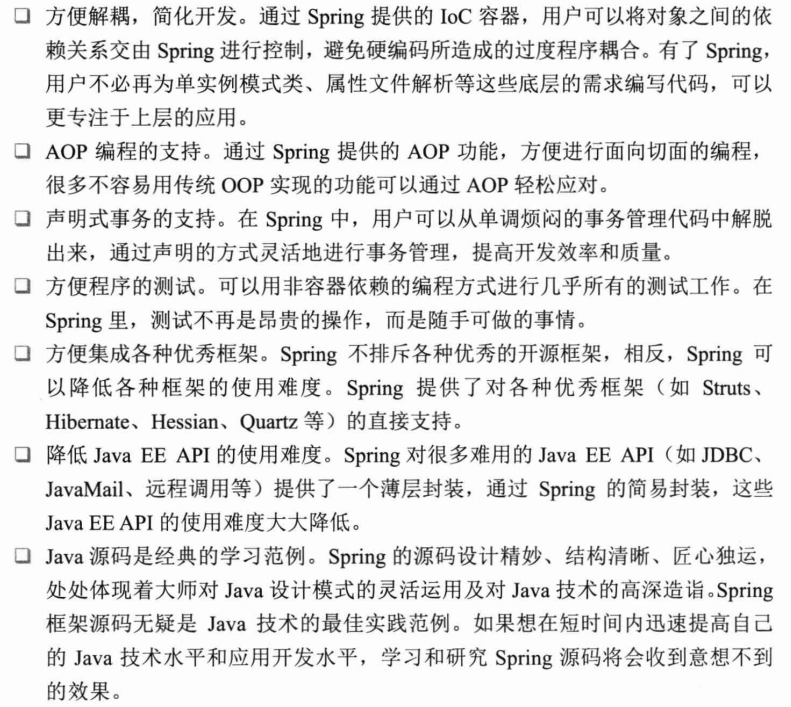

Spring框架结构
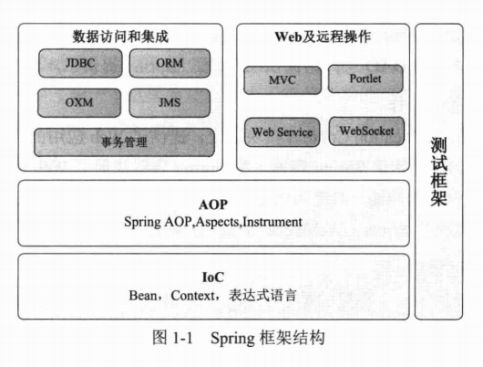

Spring子项目

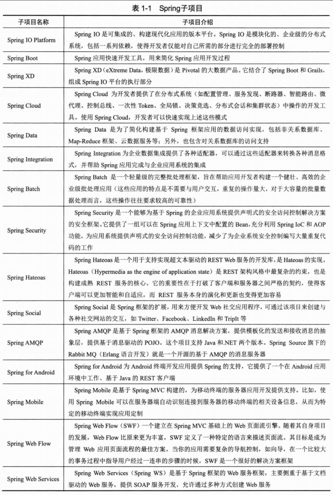
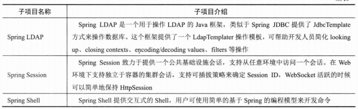

# 快速入门 #

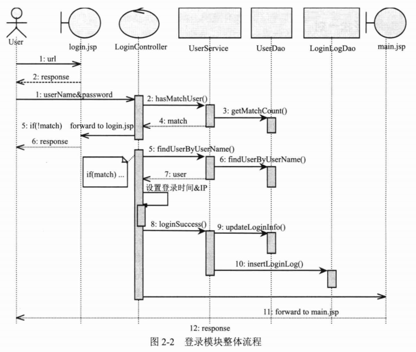

MySQL ENGINE=InnoDB(支持事务)

领域模型中的实体类可细分为4种类型：VO/DTO/DO/PO

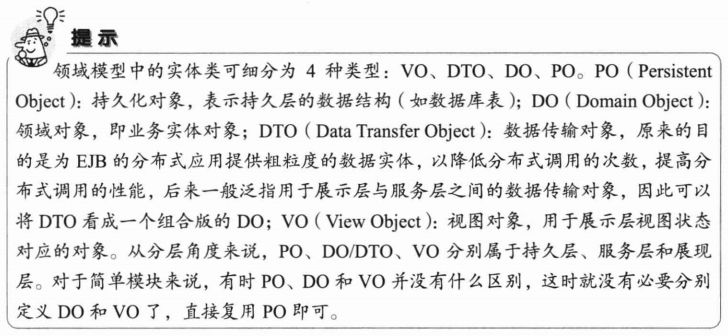

@Repository 通过Spring注解定义一个DAO

@Autowired 自动注入

SpringJDBC 对传统的JDBC API进行薄层封装

在DAO中编写SQL语句时，通常将SQL语句写在类静态变量中

@Service 服务层的Bean

	<?xml version="1.0" encoding="UTF-8" ?>
	<beans ...>
	    
	    <!-- 扫描类包，将标注Spring注解的类自动转化Bean，同时完成Bean的注入 -->
	    <context:component-scan base-package="com.smart.dao"/>
	    <context:component-scan base-package="com.smart.service"/>
	    
	    <!-- 配置数据源 -->
		<bean id="dataSource" class="org.apache.commons.dbcp.BasicDataSource"
			destroy-method="close" 
			p:driverClassName="com.mysql.jdbc.Driver"
			p:url="jdbc:mysql://localhost:3306/sampledb"
			p:username="root"
			p:password="123" />
	
		<!-- 配置Jdbc模板  -->
		<bean id="jdbcTemplate" class="org.springframework.jdbc.core.JdbcTemplate"
			p:dataSource-ref="dataSource" />
			
		<!-- 配置事务管理器 -->
		<bean id="transactionManager"
			class="org.springframework.jdbc.datasource.DataSourceTransactionManager"
			p:dataSource-ref="dataSource" />
			
		<!-- 通过AOP配置提供事务增强，让service包下所有Bean的所有方法拥有事务 -->
		<aop:config proxy-target-class="true">
			<aop:pointcut id="serviceMethod"
				expression="(execution(* com.smart.service..*(..))) and (@annotation(org.springframework.transaction.annotation.Transactional))" />
			<aop:advisor pointcut-ref="serviceMethod" advice-ref="txAdvice" />
		</aop:config>
		<tx:advice id="txAdvice" transaction-manager="transactionManager">
			<tx:attributes>
				<tx:method name="*" />
			</tx:attributes>
		</tx:advice>
	</beans>

---

TestNG VS JUnit

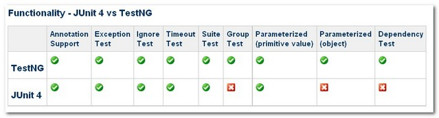

---

SpringMVC

web.xml

	<web-app>
	
		<context-param>
			<param-name>contextConfigLocation</param-name>
			<param-value>classpath:smart-context.xml</param-value>
		</context-param>

		<!--启动Spring容器的监听器-->
		<listener>
			<listener-class>
				org.springframework.web.context.ContextLoaderListener
			</listener-class>
		</listener>
	
		<!-- Spring MVC地址映射-->
		<servlet>
			<servlet-name>smart</servlet-name>
			<servlet-class>
				org.springframework.web.servlet.DispatcherServlet
			</servlet-class>
			<load-on-startup>3</load-on-startup>
		</servlet>
	
	</web-app>

SpringMVC约定servlet

/WEB-INF下，有<Servlet name>-servlet.xml的形式

@Controller 标注成一个Spring

smart-servlet.xml配置文件

	<beans ...>
		<!-- 扫描web包，应用Spring的注解 -->
		<context:component-scan base-package="com.smart.web"/>
		
		<!-- 配置视图解析器，将ModelAndView及字符串解析为具体的页面 -->
		<bean
			class="org.springframework.web.servlet.view.InternalResourceViewResolver"
			p:viewClass="org.springframework.web.servlet.view.JstlView" 
			p:prefix="/WEB-INF/jsp/"<!--前缀-->
			p:suffix=".jsp" /><!--后缀-->
	
	</beans>

---

pom.xml需要有的

    <plugin>
        <groupId>org.mortbay.jetty</groupId>
        <artifactId>maven-jetty-plugin</artifactId>
        <version>6.1.25</version>
        <configuration>
            <connectors>
                <connector implementation="org.mortbay.jetty.nio.SelectChannelConnector">
                    <port>8000</port>
                    <maxIdleTime>60000</maxIdleTime>
                </connector>
            </connectors>
            <contextPath>/bbs</contextPath>
            <scanIntervalSeconds>0</scanIntervalSeconds>
        </configuration>
    </plugin>

运行jetty maven jetty:run

# Spring Boot #

Spring Boot特点

- 为开发者提供Spring快速入门体验
- 内嵌Tomcat和Jetty容器，无需部署WAR文件到Web容器就可独立运行应用
- 提供许多基于Maven的pom配置模板来简化工程配置
- 提供实现**自动化**配置的基础设施
- 提供可直接在生产环境中使用的功能，如性能指标、应用信息和应用健康检查
- 开箱即用，没有代码生成，也无需XML配置文件，支持修改默认值来满足特定需求

Spring是由一系列启动器组成的，这些启动器构成一个强大的，灵活的开发助手。开发人员根据项目需要，选择并组合相应的启动器，就可以快速搭建一个适合项目需要的基础运行框架

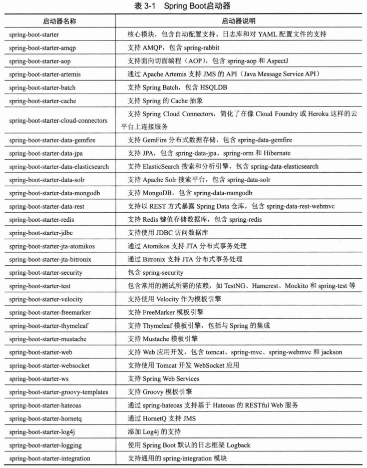

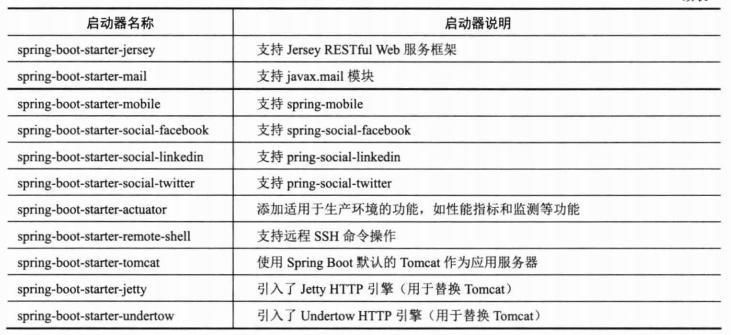

基于Maven和Gradle

基于Spring Boot CLI环境配置
 基于命令行

@EnableTransactionManagerment注解开启事务支持，相当于XML<tx:annotation-driven/>允许@Transactional

	<project ...>
	    <parent>
	        <groupId>org.springframework.boot</groupId>
	        <artifactId>spring-boot-starter-parent</artifactId>
	        <version>1.3.3.RELEASE</version>
	    </parent>
	    <modelVersion>4.0.0</modelVersion>
	    <artifactId>HelloSpringBoot</artifactId>
	    <name>Spring4.x第三章实例</name>
	    <packaging>war</packaging>
	    <dependencies>
	    
	    	<!-- Boot Web启动器 -->
	        <dependency>
	            <groupId>org.springframework.boot</groupId>
	            <artifactId>spring-boot-starter-web</artifactId>
	        </dependency>
	
			<!-- 连接数据库 -->
	        <dependency>
	            <groupId>org.springframework.boot</groupId>
	            <artifactId>spring-boot-starter-jdbc</artifactId>
	        </dependency>
	        <dependency>
	            <groupId>mysql</groupId>
	            <artifactId>mysql-connector-java</artifactId>
	            <version>${mysql.version}</version>
	        </dependency>
	
			<!-- 监控功能 -->
	        <dependency>
	            <groupId>org.springframework.boot</groupId>
	            <artifactId>spring-boot-starter-actuator</artifactId>
	        </dependency>
	        
	        <!-- Spring MVC -->
	        <dependency>
	            <groupId>org.apache.tomcat.embed</groupId>
	            <artifactId>tomcat-embed-jasper</artifactId>
	            <scope>provided</scope>
	        </dependency>
	        <dependency>
	            <groupId>javax.servlet</groupId>
	            <artifactId>jstl</artifactId>
	        </dependency>
	        
	        <dependency>
	            <groupId>org.springframework.boot</groupId>
	            <artifactId>spring-boot-starter-test</artifactId>
	            <scope>test</scope>
	        </dependency>
	        
	    </dependencies>
	    <build>
	        <plugins>
	            <plugin>
	                <groupId>org.springframework.boot</groupId>
	                <artifactId>spring-boot-maven-plugin</artifactId>
	            </plugin>
	            <plugin>
	                <groupId>org.apache.maven.plugins</groupId>
	                <artifactId>maven-surefire-plugin</artifactId>
	                <configuration>
	                    <useSystemClassLoader>false</useSystemClassLoader>
	                </configuration>
	            </plugin>
	            <plugin>
	                <groupId>org.apache.maven.plugins</groupId>
	                <artifactId>maven-compiler-plugin</artifactId>
	                <version>2.3.2</version>
	                <configuration>
	                    <source>1.8</source>
	                    <target>1.8</target>
	                </configuration>
	            </plugin>
	            
	        </plugins>
	    </build>
	</project>

# IoC容器 #

对于软件来说，即某一接口具体实现类的选择控制权从调用类中移除，转交给第三方决定，即由Spring容器借由Bean配置来进行控制。

另一个名字：依赖注入Dependency Injection
让调用类对某一接口实现类的依赖关系由第三方（容器或协作类）注入

# 实战单元测试 #

软件测试可以分为单元测试、集成测试（开发人员）、功能测试、系统测试（测试人员）。

软件开发的标准过程包括以下几个阶段

1. 需求分析
2. 设计
3. 实现
4. 测试
5. 发布

通过单元测试可以保障功能模块的正确性。而集成测试这是在功能模块开发完成后，为验证功能模块间匹配调用的正确性而进行的测试。

---

单元测试的好处

1. 软件质量最简单、最有效的保证
2. 是目标代码最清晰、最有效的文档
3. 可以优化目标代码的设计
4. 是代码重构的保证
5. 是回归测试和持续集成的基石

---

单元测试的误解

1. 影响开发进度
2. 增加开发成本
3. 我是个编程高手，无须进行单元测试
4. 测试人员会测出所有Bug

---

单元测试困境

1. 是System.out.println跟踪和运行程序就够了（太原始的判断方法）
2. 存在太多无法测试的东西（如，过度依赖运行环境，与第三方过度耦合）
3. 测试代码可随意写
4. 不关心测试环境
5. 测试环境依赖性大

---

单元测试基本概念

- 被测系统：SUT System Under Test

表示正在被测试的系统，目的是测试系统能否正常才注意

- 测试替身：Test Double

使用替身可减少对被测对象的依赖，使得测试更加单一。同时让测试案例执行的时间更短，运行稳定。

- 测试夹具：Test Fixture

这就是测试运行程序Test Runner会在测试方法之前自动执行初始化，回收资源的工作

@BeforeMethod/@AfterMethod 细粒度
@BeforeClass/@AfterMethod

- 测试用例：Test Case

@Test标注的方法

- 测试套件：Test Suite

通过TestSuite对象将多个测试用例组装成一个测试套件，则测试套件批量运行。

助记：**水的方程式SDFCS**

## TestNG快速进阶 ##

TestNG 即可单元测试，也可继承测试

编写一个测试的过程三个典型步骤

1. 编写测试的业务逻辑并在代码中插入TestNG注解
2. 将测试信息添加testng.xml或者build.xml文件
3. 运行TestNG

---

TestNG的生命周期

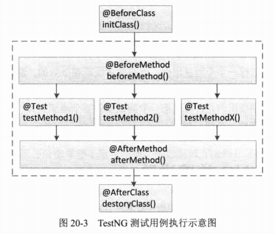

---

使用TestNg

[TestNG基本用法](TestInAction/src/test/java/sample/testng/TestNGAssertTest.java)

[TestNG测试用例依赖其他用法](TestInAction/src/test/java/sample/testng/TestNGDependsTest.java)

[TestNG异常测试](TestInAction/src/test/java/sample/testng/TestNGExceptionTest.java)

[TestNG夹具运用](TestInAction/src/test/java/sample/testng/TestNGFixtureTest.java)

[TestNG参数化测试](TestInAction/src/test/java/sample/testng/TestNGParameterTest.java)

[TestNG按组测试](TestInAction/src/test/java/sample/testng/TestNGGroupsTest.java)

[TestNG超时测试](TestInAction/src/test/java/sample/testng/TestNGTimeoutTest.java)

## 模拟利器Mockito ##

一套通过简单的方法对指定的借口或类生成Mock对象的类库

Stub 和 Mock

Stub对象用来提供测试时所需的测试数据，可以对各种交互设置相应的回应。例如，可以设置方法调用的返回值等。在Mockito中，when(...).thenReturn(...)这样语法便是设置方法调用的返回值。另外也可以设置方法在何时调用会抛出异常等。

Mock对象用来验证测试中所依赖对象间的交互是否能够达到预期。在Mockito中用verify(...).methodXxx(...)语法来验证methodXxx()方法是否按照预期进行了调用。

[创建Mock对象](TestInAction/src/test/java/sample/mockito/MockAnnotationTest.java)

[设定Mock对象的期望行为及返回值](TestInAction/src/test/java/sample/mockito/MockitoSampleTest.java)

[验证交互行为](TestInAction/src/test/java/sample/mockito/MockMethodTest.java)

## 测试整合之王 ##

Unitils测试框架的目的是让单元测试变得更加容易和可维护。

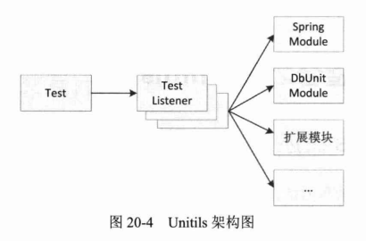

Unitils支持的模块：

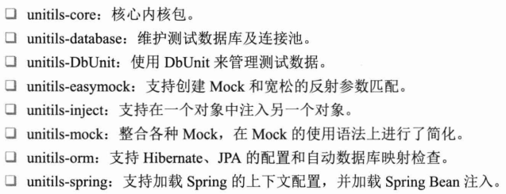

Unitils配置文件

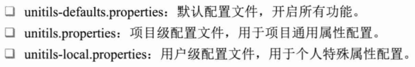

Unitils断言

在Java世界中，要比较现有两个对象实例是否相等，若没有重写equals()方法，则用两个对象的引用是否一致作为判断依据。

有时，不需关注两个对象是否引用同一个，只要两个对象的属性值一样就可以了。

在TestNG单元测试中，有两个测试方式进行这样场景测试：

1. 比较实体类中重写equals()方法，然后进行比较；
2. 把对象实例的属性一个一个进行比较。

以上操作**很繁琐**

assertReflectionEquals可解脱这繁琐

[assertReflectionEquals运用](TestInAction/src/test/java/sample/unitils/AssertReflectionEqualsTest.java)

---

Lenient a. 宽大

可以忽略默认值的断言 assertLenientEquals

[assertLenientEquals运用](TestInAction/src/test/java/sample/unitils/AssertReflectionEqualsTest.java)

---

比较对象的特定属性的方法

assertPropertyReflectionEquals
assertPropertyLenientEquals

[运用](TestInAction/src/test/java/sample/unitils/AssertReflectionEqualsTest.java)

---

集成Spring

[加载Spring的上下文](TestInAction/src/test/java/sample/unitils/spring/UserServiceTest.java)与Spring Test官档相似，这有重复加载Spring上下文，影响性能

[通过基类加载ApplicationContext](TestInAction/src/test/java/sample/unitils/spring/BaseServiceTest.java)

[通过继承使用父类的ApplicationContext](TestInAction/src/test/java/sample/unitils/spring/SimpleUserServiceTest.java)

---

集成Hibernate

	发现
	
	书本源码的unitils-orm:3.4.2 不支持 hibernate4,支持hibernate3
	
	较新版本3.4.6 依然未解决不兼容问题

	解决之道：将hibernate版本从4换成3

[通过基类加载SessionFactory](TestInAction/src/test/java/sample/unitils/hibernate/BaseDaoTest.java)

[通过继承使用父类SessionFactory](TestInAction/src/test/java/sample/unitils/hibernate/SimpleUserDaoTest.java)

	亦或使用集成Spring，间接集成hibernate4

---

集成DbUnit

基于TestNG扩展的数据库测试框架

@DataSet用于准备数据
@ExpectedDataSet用于验证数据的

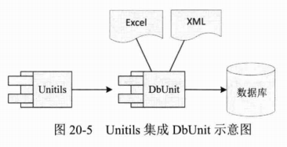

---

[自定义扩展模块骨架](TestInAction/src/test/java/sample/unitils/module/CustomExtModule.java)

另外unitils.properties配置

	unitils.modules=...，custom
	unitils.module.custom.className=sample.Custom

## 使用Unitils测试DAO层 ##

数据库测试的难点

**不可重复的单元测试是毫无价值的**

对于业务逻辑层，可以通过Mockito底层对象和上层对象来获得这种独立性或重复性。

而DAO层因为是和数据库打交道的层，其单元测试依赖于数据库的数据。

要实现DAO层单元测试的可重复性，**就需要对每次因单元测试引起的数据库中的数据变化进行还原，也就是保护单元测试数据库的数据现场**

---

**扩展DBUnit用Excel准备数据**

在测试数据访问层DAO时，通常需要经过测试数据的准备、维护、杨这张及清理过程。

这过程不仅繁琐，易出错，如数据库现场容易遭受破坏、如何对数据操作正确性进行检查等。

虽然**Spring测试框架**在这一方面为我们减轻工作，如通过事务回滚机制来保护数据库现场等，**当在测试数据及验证数据准备方面还没有一种很好的处理方式**

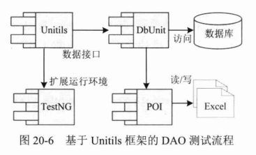

以TestNG作为整个测试的基础框架，并采用DbUnit作为自动管理数据库的工具，以XML,Excel作为测试数据及验证数据准备，最后通过Unitils的数据集注解从Excel、XML文件中加载测试数据

Unitils没有Excel读取器，需自创Excel数据集工厂，Excel数据集读取器

[Excel数据集工厂](TestInAction/src/test/java/com/smart/test/dataset/excel/MultiSchemaXlsDataSetFactory.java) 

Excel数据集工厂使用了Excel数据集读取器

[Excel数据集读取器](TestInAction/src/test/java/com/smart/test/dataset/excel/MultiSchemaXlsDataSetReader.java)

写完注意在unitils.properties上注册

	DbUnitModule.DataSet.factory.default=com.smart.test.dataset.excel.MultiSchemaXlsDataSetFactory
	DbUnitModule.ExpectedDataSet.factory.default=com.smart.test.dataset.excel.MultiSchemaXlsDataSetFactory

[测试用例](TestInAction/src/test/java/com/smart/dao/UserDaoTest.java)

- 配置Unitils测试环境，unitils.properties（**注意这的数据源要和Spring的配置的数据源要一致**）
- 配置数据集加载策略DbUnitModule.DataSet.loadStrategy.default

	- CleanInsertLoadStrategy:先删除dateSet中有关表的数据，然后再插入数据（默认）
	- InsertLoadStrategy：只插入数据
	- RefreshLoadStrategy:有同样key的数据更新，没有的插入
	- UpdateLoadStrategy:有同样key的数据更新，没有的不做任何操做
	
- 配置事务策略DbUnitModule.DataSet.loadStrategy.default
	- commit 是单元测试方法过后提交事务
	- rollback 是回滚事务
	- disabled 是没有事务，默认情况下，事务管理是disabled

- 准备测试数据库及测试数据
- 创建测试数据库
- 连接到测试数据库
- 用Excel准备测试数据
- 编写测试用例

[一个获取Excel数据集的Bean工厂XlsDataSetBeanFactory](TestInAction/src/test/java/com/smart/test/dataset/util/XlsDataSetBeanFactory.java)

## 使用Unitils测试Service层 ##

[Service层测试用例](TestInAction/src/test/java/com/smart/service/UserServiceTest.java)

ReflectionTestUtils是Spring Test设置访问测试对象中私有属性非常好用的工具类 

## 测试web层 ##

使用Spring的org.springframework.mock包中为一些依赖于容器的借口提供了模拟类

[待测Controller类](TestInAction/src/main/java/com/smart/web/LoginController.java)

[使用Spring Servlet API及Spring RestTemplate测试](TestInAction/src/test/java/com/smart/web/LoginControllerTest.java)

另外，测试不同浏览器访问应用需要用到Selenium, 4.x书有关章节已删，请翻阅旧3.x书

**小结**

- 对Dao层的测试，Unitils+DbUnit
- 对Service层的测试，TestNG+Unitils+Mockito
- 对Service + DAO层测试，TestNG+Unitils+DbUnit

