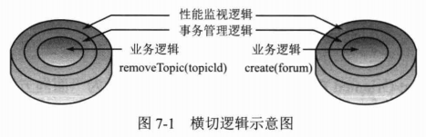
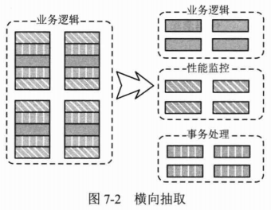
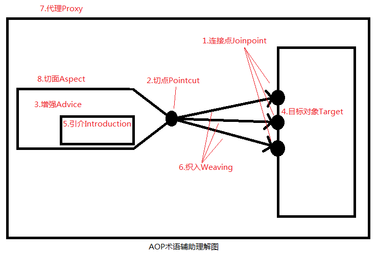

# Spring AOP 基础 #

应用场景：

- 性能检测
- 访问控制
- 事务管理
- 日志记录

## AOP概述 ##

**AOP** Aspect Oriented Programing **面向切面编程**

AOP独辟蹊径通过**横向抽取机制**为这类无法通过**纵向继承体系进行抽象的重复性代码**提供了解决方案。

### AOP术语 ###

1. **连接点Jointpoint** 程序执行的某个特定位置：如类的开始初始化前或后、类某方法前或后，方法抛出异常后。Spring仅支持方法的连接点：a.方法调用前、b.方法调用后、c.方法抛出异常时、d.方法调用前后 这些程序执行点织入增强。
2. **切点Pointcut** AOP通过“切点”定位连接点。
3. **增强Advice** 指织入到目标类连接点上的一段程序代码
4. **目标对象Target** 增强织入目标类
5. **引介Introduction** 引介是一种特殊的增强，它为类添加一些属性和方法
6. **织入Weaving** 指将增强添加对目标类具体连接点上的过程，Spring通过动态代理织入。
7. **代理Proxy** 一个类被AOP织入增强后，就产生了一个结果类，它是融合了原类和增强逻辑的代理类
8. **切面Aspect** 切面由切点和增强(引介)组成，它既包括横切逻辑的定义，也包括连接点的定义。

### AOP的实现者 ###

- AspectJ
- AspectWerkz
- JBossAOP
- SpringAOP

## 基础知识 ##

Spring AOP使用两种代理机制：1.基于JDK的动态代理；2.基于动态代理。之所以需要两种代理机制，很大程度上是因为JDK本身只提供接口的代理，而不支持类的代理

### 带有横向逻辑的实例 ###

[ForumServiceImpl](src/main/java/com/smart/proxy/ForumServiceImpl.java)

[性能检测](src/main/java/com/smart/proxy/PerformanceMonitor.java)

上述 **非业务逻辑的性能监视代码** 破坏了 **真正业务逻辑的纯粹性**

### JDK动态代理 ###

代理

[移除横切代码的ForumServiceImpl](src/main/java/com/smart/proxy/ForumServiceImpl.java)

[横切代码的安家地](src/main/java/com/smart/proxy/PerformaceHandler.java)

[创建代理实例](src/test/java/com/smart/proxy/ForumServiceTest.java)

### CGLib动态代理 ###

使用JDK创建代理有一个限制，即它只能为**接口**创建代理实例

[CglibProxy](src/main/java/com/smart/proxy/CglibProxy.java)

[创建代理实例2](src/test/java/com/smart/proxy/ForumServiceTest.java)

### AOP联盟 ###

### 代理代码知识小结 ###

上代理示例有三处需要改进

1. 目标类的所有方法都添加了性能监视横切逻辑，而有时这并不是我们所期望的，我们可能只希望对**业务类中的某些特定方法**添加横切逻辑

2. 通过硬编码的方式指定了织入横切逻辑的**织入点**，即在目标类业务方法的开始和结束前织入代码

3. 手工编写代理实例的创建过程，在为不同类创建代理时，需要分别编写相应的创建代码，无法做到通用

Spring AOP 围绕上述三点展开

1. 通过**切点Pointcut**指定在哪些类的哪些方法上织入横切逻辑

2. 通过Advice增强描述横切逻辑和方法的具体织入点（方法前、方法后、方法两端等

3. Spring 通过**Advisor切面**将Pointcut和Advice组装起来，有了Advisor的信息，Spring就可以利用JDK或CGLib动态代理技术采用统一的方式为目标Bean创建织入切面的代理对象

JDK和CGLib创建对象时性能各有差异

对于singleton的代理对象或者具有实例池的代理，因为无需频繁地创建代理对象，所以比较适合采用CGLib动态代理技术，反之用JDK

## 创建增强类 ##

Spring 通过**Advisor切面**将Pointcut和Advice组装起来

- 前置增强
- 后置增强
- 环绕增强
- 抛出增强
- 引介增强

### 前置增强 ###

BeforeAdvice是前置增强的接口，方法前置增强的MethodBeforeAdvice接口是 其子类

[实现MethodBeforeAdvice接口的前置增强](src/main/java/com/smart/advisor/GreetingBeforeAdvice.java)

[运行测试](src/test/java/com/smart/advice/BeforeAdviceTest.java)

---

Proxy内部就是使用JDK代理或CGLib代理的技术

使用JDK代理技术的写法

	ProxyFactory pf = new ProxyFactory();
	pf.setInterfaces(target.getClass().getInterfaces());
	pf.setTarget(target);
	pf.addAdvice(advice);

若指定启用代理优化，ProxyFactory还将使用Cglib2AopProxy代理

	ProxyFactory pf = new ProxyFactory();
	pf.setInterfaces(target.getClass().getInterfaces());
	pf.setTarget(target);
	pf.addAdvice(advice);
	pf.setOptimize(true);

---

在Spring配置文件中使用

[配置文件](src/main/resources/com/smart/advice/beans.xml)

[运行测试类](src/test/java/com/smart/advice/AdviceTest.java)

### 后置增强 ###

[实现AfterReturningAdvice接口后置增强类](src/main/java/com/smart/advice/GreetingAfterAdvice.java)

[配置文件](src/main/resources/com/smart/advice/beans.xml)

[运行测试类](src/test/java/com/smart/advice/AdviceTest.java)

### 环绕增强 ###

前置增强和后置增强的组合

[实现MethodInterceptor接口环绕增强类](src/main/java/com/smart/advice/GreetingInterceptor.java)

[配置文件](src/main/resources/com/smart/advice/beans.xml)

[运行测试类](src/test/java/com/smart/advice/AdviceTest.java)

### 异常抛出增强 ###

[模拟ThrowsAdvice抛异常现场](src/main/java/com/smart/advice/ForumService.java)

[实现ThrowAdvice接口的异常抛出增强类](src/main/java/com/smart/advice/TransactionManager.java)

**注意** ThrowsAdvice接口未定义任何方法，它是**标识接口**（如，java.io.Serializable告诉JVM可被序列化）

在运行期Spring使用反射的机制自行判断，必须采用以下签名形式定义异常抛出的增强方法

	void afterThrowing([Method method, Object[] args, Object target],Throwable);

前三个参数要么提供，要么不提供，缺一不可

[运行测试类](src/test/java/com/smart/advice/ThrowAdviceTest.java)

### 引介增强 ###

它是一种比较特殊的增强类型，它不是在目标方法周围织入增强，而是为目标类创建的方法和属性

所以引介增强的连接点是**类级别**的，而非方法级别的。

通过引介增强，可以为目标类添加一个接口的实现，即原来目标类为实现某个接口，通过引介增强可为目标类创建实现某接口的代理。

Spring定义引介接口IntroductionInterceptor，实现DelegatingIntroductionInterceptor类，一般情况通过扩展实现类来自定义引介增强类。

使用场景：手工打开或关闭性能监视的功能

[Monitorable设置一个开关的接口](src/main/java/com/smart/introduce/Monitorable.java)

[继承DelegatingIntroductionInterceptor类](src/main/java/com/smart/introduce/ControllablePerformaceMonitor.java)

上例使用ThreadLocal变量，是因为这个控制状态使代理类变成了非线程安全的实例，为了解决单实例线程安全的问题，通过ThreadLocal让每个线程单独使用一个状态。

[配置文件](src/main/resources/com/smart/introduce/beans.xml)

[运行测试类](src/test/java/com/smart/introduce/IntroduceTest.java)

## 创建切面 ##

**增强**提供了连接点方位信息，如织入到方法前后，而**切点**进一步描述了织入哪些方法上。

Spring通过org.springframework.aop.Pointcut接口描述切点，Pointcut由ClassFilter(定位哪个类上的)和MethodMatcher定位到某些特定方法上

Spring支持两种方法匹配器

- 静态方法匹配器 仅对方法名签名(包括方法名和入参类型及顺序)进行匹配

- 动态方法匹配器 在运行期间检查方法入参的值

静态匹配仅会判别一次，而动态匹配因为每次调用方法入参都可能不一样，所以每次调用方法都必须判断，因此，动态匹配对性能的影响很大

动态匹配较少用

### 切点类型 ###

- 静态方法切点
- 动态方法切点
- 注解切点
- 表达式切点
- 流程切点
- 复合切点

### 切面类型 ###

由于**增强**既包含横切代码，又包含部分连接点信息(方法前，方法后主访问信息)，所以可以仅通过**增强**类生成一个**切面**。

但**切点**仅代表**目标**类**连接点**的部分信息(类和方法的定位)，所以仅有切点无法制作出一个切面，必须结合**增强**才能制作出**切面**

	增强 -> 切面 or 切点 + 增强 ->切面
	
	但 切点 !-> 切面

---

切面可分为3类

- Advisor 代表一般切面，仅包含一个Advice。它的连接点是目标类的所有方法，横切面过于广泛而少人问津

- PointcutAdvisor 代表具有切点的切面，包含**Advice**和**Pointcut**两个类，这样就可以通过类、方法名及方位等信息灵活地定义切面的连接点，提供更具适用性的切面

	- DefaultPointcutAdvisor 最常用的切面类型，一般可通过扩展该类实现自定义的切面
	- NameMatchMethodPointcutAdvisor
	- RegexpMethodPointcutAdvisor 
	- StaticMethodMathcerPointcutAdvisor
	- AspectJExpressionPointcutAdvisor
	- AspectJPointcutAdvisor

- IntroductionAdvisor 代表引介切面，应用于类层面上

### 静态普通方法名匹配切面 ###

[实现StaticMethodMatcherPointcutAdvisor切面](src/main/java/com/smart/advisor/GreetingAdvisor.java)
 定位哪个类，哪个方法，就是定义了个切点

还要有一个**增强**

[前置增强](src/main/java/com/smart/advisor/GreetingBeforeAdvice.java)

---

配置文件定义切面

	<!--Target-->
	<bean id="waiterTarget" class="com.smart.advisor.Waiter" />
	<bean id="sellerTarget" class="com.smart.advisor.Seller" />
	
	<!-- 增强Advice -->
	<bean id="greetingAdvice" class="com.smart.advisor.GreetingBeforeAdvice" />
	<!--切面-->
	<bean id="greetingAdvisor" class="com.smart.advisor.GreetingAdvisor"
		p:advice-ref="greetingAdvice" />

	<!-- target + 切面 -> 代理类 -->
	<bean id="parent" abstract="true"
		class="org.springframework.aop.framework.ProxyFactoryBean"
		p:interceptorNames="greetingAdvisor" p:proxyTargetClass="true" />
	<bean id="waiter" parent="parent" p:target-ref="waiterTarget" />
	<bean id="seller" parent="parent" p:target-ref="sellerTarget" />

---

[运行测试类](src/test/java/com/smart/advisor/StaticMethodAdvisorTest.java)

### 静态正则表达式方法匹配切面 ###

RegexpMethodPointcutAdvisor功能齐备实现类，一般情况下，无须扩展该类。

	<!-- 正则表达式方法名匹配切面 -->
	<bean id="regexpAdvisor"
		class="org.springframework.aop.support.RegexpMethodPointcutAdvisor"
		p:advice-ref="greetingAdvice">
		<property name="patterns">
			<list>
				<value>.*greet.*</value>
			</list>
		</property>
	</bean>

	<!-- 切面 + 目标 -> 代理 -->
	<bean id="waiter1" class="org.springframework.aop.framework.ProxyFactoryBean"
		p:interceptorNames="regexpAdvisor" p:target-ref="waiterTarget"
		p:proxyTargetClass="true" />

[运行测试类](src/test/java/com/smart/advisor/RegexpAdvisorTest.java)

### 动态切面 ###

通过DefaultPointcutAdvisor和DynamicMethodMatcherPointcut来完成相同的功能

动态方法匹配器 在运行期间检查方法入参的值

动态切面很耗性能

Spring采用这样的机制：在创建代理时对目标类的每个连接点使用静态切点检查，若通过静态切点检查就知道连接点是不匹配的，则在运行时就不再进行动态检查；如果静态切点检查是匹配的，则在运行时才进行动态切点检查。

[扩展DynamicMethodMatcherPointcut类](src/main/java/com/smart/advisor/GreetingDynamicPointcut.java)

---

动态切面配置

	<!-- 动态切面 -->
	<bean id="dynamicAdvisor" class="org.springframework.aop.support.DefaultPointcutAdvisor">
		<property name="pointcut">
			<bean class="com.smart.advisor.GreetingDynamicPointcut" />
		</property>
		<property name="advice">
			<bean class="com.smart.advisor.GreetingBeforeAdvice" />
		</property>
	</bean>

	<bean id="waiter2" class="org.springframework.aop.framework.ProxyFactoryBean"
		p:interceptorNames="dynamicAdvisor" 
		p:target-ref="waiterTarget"
		p:proxyTargetClass="true" />

[运行测试类](src/test/java/com/smart/advisor/DynamicAdvisorTest.java)

注意：定义动态切点时，切勿忘记同时覆盖getClassFilter()和matches(Method method, Class clazz)方法时，通过静态切点检查排除掉大部分方法。

### 流程切面 ###

Spring流程切面由DefaultPointcutAdvisor和ControlFlowPointcut实现。流程切点代表由某个方法直接或间接发起调用的其他方法。

[通过WaiterDelegate代理Waiter所有方法](src/main/java/com/smart/advisor/WaiterDelegate.java)

**我们目的是将所有WaiterDelegate#service()方法调用的其它方法都织入加强**

---

配置文件

	<！--切点-->
	<bean id="controlFlowPointcut" class="org.springframework.aop.support.ControlFlowPointcut">
		<！-- 指定流程切点的类 -->
		<constructor-arg type="java.lang.Class" 	value="com.smart.advisor.WaiterDelegate" />

		<!--指定流程切点的方法-->
		<constructor-arg type="java.lang.String" value="service" />
	</bean>

	<!--切面-->
	<bean id="controlFlowAdvisor" class="org.springframework.aop.support.DefaultPointcutAdvisor"
		p:pointcut-ref="controlFlowPointcut" p:advice-ref="greetingAdvice" />

	<!--代理类-->
	<bean id="waiter3" class="org.springframework.aop.framework.ProxyFactoryBean"
		p:interceptorNames="controlFlowAdvisor" p:target-ref="waiterTarget"
		p:proxyTargetClass="true" />

---

[运行测试类](src/test/java/com/smart/advisor/ControlFlowAdvisorTest.java)

### 复合切点切面 ###

根据上面流程切面的例子中，假设我们希望有WaiterDelegate#service()发起调用且被调用的方法是Waiter#greetTo()时才织入增强。这就是复合切点

ComposablePointcut可将多个切点以并集或交集的方式组合起来，提供了切点之间复合运算的功能。

[ComposablePointcut示例](src/main/java/com/smart/advisor/GreetingComposablePointcut.java)

---

配置文件

	<!-- 复合切点切面 -->
	<bean id="gcp" class="com.smart.advisor.GreetingComposablePointcut" />

	<bean id="composableAdvisor" class="org.springframework.aop.support.DefaultPointcutAdvisor"
		<!--引用gcp.getIntersectionPointcut()方法所返回的复合切点-->
		p:pointcut="#{gcp.intersectionPointcut}" p:advice-ref="greetingAdvice" />

	<bean id="waiter4" class="org.springframework.aop.framework.ProxyFactoryBean"
		p:interceptorNames="composableAdvisor" p:target-ref="waiterTarget"
		p:proxyTargetClass="true" />

---

[运行测试类](src/test/java/com/smart/advisor/ComposableAdvisorTest.java)

### 引介切面 ###

引介切面是引介增强的封装器，通过引介切面，更容易为现有的对象添加任何接口实现。

---

根据前面的引介增强，设置一个监测开关

配置文件

	<!--引入切面-->
	<bean id="introduceAdvisor"
		class="org.springframework.aop.support.DefaultIntroductionAdvisor">
		<constructor-arg>
			<bean class="com.smart.introduce.ControllablePerformaceMonitor" />
		</constructor-arg>
	</bean>
	
	<!-- 目标 -->
	<bean id="forumServiceTarget" class="com.smart.introduce.ForumService" />

	<bean id="forumService" class="org.springframework.aop.framework.ProxyFactoryBean"
	      p:interceptorNames="introduceAdvisor"
	      p:target-ref="forumServiceTarget"
	      p:proxyTargetClass="true"/>

---

[运行测试类](src/test/java/com/smart/advisor/IntroduceAdvisorTest.java)

## 自动创建代理 ##

上面的例子都通过ProxyFactoryBean创建织入切面的代理，每个需要被代理的Bean都需要使用一个ProxyFactoryBean进行配置，虽然可以使用父子&lt;bean&gt;进行改造，但还是很麻烦。

Spring使用BeanPostProcessor完成自动生成代理的工作。

BeanNameAutoProxyCreator实现ProxyFactoryBean接口，DefaultAdvisorAutoProxyCreator继承BeanNameAutoProxyCreator

### BeanNameAutoProxyCreator ###

根据Bean的名字匹配

	<bean id="waiter" class="com.smart.advisor.Waiter" />
	<bean id="seller" class="com.smart.advisor.Seller" />
	<bean id="greetingAdvice" class="com.smart.advisor.GreetingBeforeAdvice" />

	<bean class="org.springframework.aop.framework.autoproxy.BeanNameAutoProxyCreator"
		p:beanNames="*er" 
		p:interceptorNames="greetingAdvice"
		p:optimize="true"/>

----

[运行测试类](src/test/java/com/smart/autoproxy/BeanNameAutoProxyCreatorTest.java)

### DefaultAdvisorAutoProxyCreator ###

感觉这更强大

	<bean id="waiter" class="com.smart.advisor.Waiter" />
	<bean id="seller" class="com.smart.advisor.Seller" />
	<bean id="greetingAdvice" class="com.smart.advisor.GreetingBeforeAdvice" />

	<bean id="regexpAdvisor"
		class="org.springframework.aop.support.RegexpMethodPointcutAdvisor"
		p:patterns=".*greet.*" p:advice-ref="greetingAdvice"  />
	<bean class="org.springframework.aop.framework.autoproxy.DefaultAdvisorAutoProxyCreator"  p:proxyTargetClass="true" />

[运行测试类](src/test/java/com/smart/autoproxy/BeanNameAutoProxyCreatorTest.java)

### (新增)AOP无法增强疑难问题 ###

这章做一下了解

[AOP无法增强疑难](src/main/java/com/smart/aop/BeanSelfProxyAware.java)

