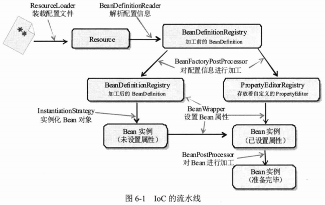
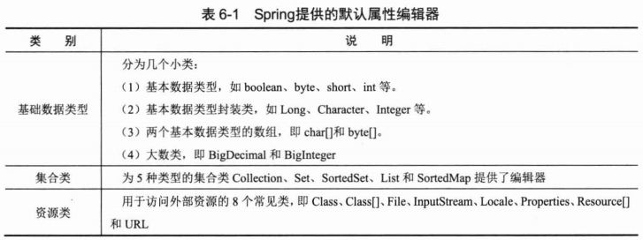
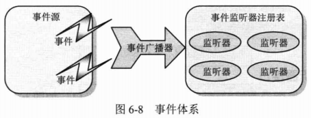

# Spring容器高级主题 #

## Spring容器技术内幕 ##

### 内部工作机制 ###

Spring的AbstractApplicationContext是ApplicationContext的抽象实现类，该抽象类的refresh()方法定义了Spring容器在加载配置文件后的各项处理过程，这些处理过程清晰刻画了Spring容器启动时的各项操作。

	public void refresh() throws BeansException, IllegalStateException {
		synchronized (this.startupShutdownMonitor) {
			// Prepare this context for refreshing.
			prepareRefresh();

			// Tell the subclass to refresh the internal bean factory.
			ConfigurableListableBeanFactory beanFactory = obtainFreshBeanFactory();

			// Prepare the bean factory for use in this context.
			prepareBeanFactory(beanFactory);

			try {
				// Allows post-processing of the bean factory in context subclasses.
				postProcessBeanFactory(beanFactory);

				// Invoke factory processors registered as beans in the context.
				invokeBeanFactoryPostProcessors(beanFactory);

				// Register bean processors that intercept bean creation.
				registerBeanPostProcessors(beanFactory);

				// Initialize message source for this context.
				initMessageSource();

				// Initialize event multicaster for this context.
				initApplicationEventMulticaster();

				// Initialize other special beans in specific context subclasses.
				onRefresh();

				// Check for listener beans and register them.
				registerListeners();

				// Instantiate all remaining (non-lazy-init) singletons.
				finishBeanFactoryInitialization(beanFactory);

				// Last step: publish corresponding event.
				finishRefresh();
			}

			catch (BeansException ex) {
				logger.warn("Exception encountered during context initialization - cancelling refresh attempt", ex);

				// Destroy already created singletons to avoid dangling resources.
				destroyBeans();

				// Reset 'active' flag.
				cancelRefresh(ex);

				// Propagate exception to caller.
				throw ex;
			}

			finally {
				// Reset common introspection caches in Spring's core, since we
				// might not ever need metadata for singleton beans anymore...
				resetCommonCaches();
			}
		}
	}

Spring组件按其承担的角色可划分为两类：

1. 物料组件：Resource、BeanDefinition、Property以及最终的Bean等他，它们是加工流程中被加工、被消费的组件，就像流水线上被加工的物料
2. 加工设备组件：ResourceLoader、BeanDefinitionReader、BeanFacotryPostProcessor、InstantiationStrategy以及BeanWrapper等组键像是流水线上不同环节的加工设备，对物料组件进行加工处理。

### BeanDefinition ###

Spring通过BeanDefinition将配置文件中的&lt;bean&gt;配置信息转换为容器的内部表示，并将这些BeanDefinition注册到BeanDefinitionRegistry

### InstantiationStrategy ###

InstantiationStrategy仅负责实例化Bean的操作，相当于执行Java语言中new的功能，它并不会参与Bean属性的设置工作。

所以由InstantiationStrategy返回的Bean实例实际上是一个半成品的Bean实例，属性填充工作留给BeanWrapper来完成

### BeanWrapper ###

Spring通过BeanWrapper完成Bean属性的填充工作。

## 属性编辑器 ##

它的主要功能就是将外部的设置值转换为JVM内部的对应类型，所以它其实是一个类型转换器

### JavaBean的编辑器 ###

Sun所指定的JavaBean规范通过java.beans.PropertyEditor定义了设置Java属性的方法，通过BeanInfo描述了JavaBean的哪些属性时可定制的，此外还描述了可定制属性与PropertyEditor的对应关系

### Spring默认属性编辑器 ###

它没有UI界面，仅负责将配置文件中的文本配置值转换为Bean属性的对应值。

### 自定义属性编辑器 ###

[自定义属性编辑器](src/main/java/com/smart/editor/CustomCarEditor.java)

[注册自定义的属性编辑器](src/main/resources/com/smart/editor/beans.xml)

[运行检验类](src/test/java/com/smart/editor/CustomerEditorTest.java)

## 使用外部属性文件 ##

好处：

1. 减少维护的工作量
2. 是部署更简单

外部属性文件

	dbName=sampledb
	driverClassName=com.mysql.jdbc.Driver
	url=jdbc:mysql://localhost:3306/${dbName}
	userName=root
	password=123456

---

指定外部配置

	<bean class="org.springframework.beans.factory.config.PropertyPlaceholderConfigurer" p:fileEncoding="utf-8">
		<property name="locations">
			<list>
				<value>classpath:com/smart/placeholder/jdbc.properties</value>
			</list>
		</property>
	</bean>

---

或更优雅的写法

	<context:property-placeholder location="classpath:com/smart/placeholder/jdbc.properties" file-encoding="utf8"/>

---

开始使用

	<bean id="dataSource" class="org.apache.commons.dbcp.BasicDataSource"
		destroy-method="close" p:driverClassName="${driverClassName}" p:url="${url}"
		p:username="${userName}" p:password="${password}" />

---

[基于注解的使用外部引用](src/main/java/com/smart/placeholder/MyDataSource.java)

### 使用加密属性文件 ###

[DES加密解密工具类](src/main/java/com/smart/placeholder/DESUtils.java)

[自定义PropertyPlaceholderConfigurer可以支持密文版的属性文件](src/main/java/com/smart/placeholder/EncryptPropertyPlaceholderConfigurer.java)

使用加密版的属性文件

	<bean class="com.smart.placeholder.EncryptPropertyPlaceholderConfigurer"
	    p:location="classpath:com/smart/placeholder/jdbc.properties"
		p:fileEncoding="utf-8"/>

	<bean id="dataSource" class="org.apache.commons.dbcp.BasicDataSource"
		destroy-method="close" p:driverClassName="${driverClassName}" p:url="${url}"
		p:username="${userName}" p:password="${password}" />

### 属性文件自身的引用 ###

	dbName=learnmybatis
	driverClassName=com.mysql.jdbc.Driver
	url=jdbc:mysql://localhost:3306/${dbName}

## 引用Bean的属性值 ##

Spring通过#{beanName.propName}表达式引用属性值

	<bean id="sysConfig" class="com.smart.beanprop.SysConfig"
	      init-method="initFromDB"
	      p:dataSource-ref="dataSource"/>
	
	<bean class="com.smart.beanprop.ApplicationManager"
	    p:maxTabPageNum="#{sysConfig.maxTabPageNum}"
	    p:sessionTimeout="#{sysConfig.sessionTimeout}"/>  

---

[基于注解的引用Bean的属性值](src/main/java/com/smart/beanprop/ApplicationManager.java)

## 国际化信息 ##

Java通过java.util.Locale类表示一个本地化对象，它允许通过语言参数和国家/地区参数创建一个确定的本地化对象

	Locale locale = new Locale("zh", "CN");

[Locale、ResourceBundle的用例](src/main/java/com/smart/i18n/LocaleSample.java)

### MessageSource ###

Spring定义了访问国际化信息的MessageSource接口

ResourcesBundleMessageSource实现MessageSource接口

	<bean id="myResource1" class="org.springframework.context.support.ResourceBundleMessageSource">
	<property name="basenames">
	   <list>
	     <value>com/smart/i18n/fmt_resource</value>
	   </list>
	</property>
	</bean> 

---

		private static void rsrBdlMessageResource(){
		String[] configs = {"com/smart/i18n/beans.xml"};
		ApplicationContext ctx = new ClassPathXmlApplicationContext(configs);
		
		MessageSource ms = (MessageSource)ctx.getBean("myResource1");
		Object[] params = {"John", new GregorianCalendar().getTime()};
		
		String str1 = ms.getMessage("greeting.common",params,Locale.US);
		String str2 = ms.getMessage("greeting.morning",params,Locale.CHINA);
		String str3 = ms.getMessage("greeting.afternoon",params,Locale.CHINA);
		System.out.println(str1);
		System.out.println(str2);
		System.out.println(str3);
		
	}

---

ReloadableResourceBundleMessageSource能够定时刷新资源文件

	<bean id="myResource2" class="org.springframework.context.support.ReloadableResourceBundleMessageSource">
	<property name="basenames">
	   <list>
	     <value>com/smart/i18n/fmt_resource</value>
	   </list>
	</property>
	<property name="cacheSeconds" value="2"/><!--秒-->
	</bean>  

[ResourceBundleMessageSource的用例](src/main/java/com/smart/i18n/I18nGreeting.java)

### 容器级的国际化信息资源 ###

国际化信息资源一般在系统输出信息时使用，如SpringMVC的页面标签、控制器（Controller）等，不同的模块都可能通过这些组件访问国际化信息资源，因此Spring将**国际化信息资源**作为**容器的公共基础设施**对所有组件开放

注册资源Bean，其Bean名称只能为messageSource，否则会报异常

	<bean id="messageSource" class="org.springframework.context.support.ResourceBundleMessageSource">
	<property name="basenames">
	   <list>
	     <value>com/smart/i18n/fmt_resource</value>
	   </list>
	</property>
	</bean> 

---

国际化信息资源
 
	private static void ctxMessageResource() throws Exception{
		String[] configs = {"com/smart/i18n/beans.xml"};
		ApplicationContext ctx = new ClassPathXmlApplicationContext(configs);
		Object[] params = {"John", new GregorianCalendar().getTime()};
		
		String str1 = ctx.getMessage("greeting.common",params,Locale.US);
		String str2 = ctx.getMessage("greeting.morning",params,Locale.CHINA);	
		System.out.println(str1);
		System.out.println(str2);	
	}

直接ApplicationContext#getMessage使用

## 容器事件 ##

事件体系中的三个角色

---

### 解构Spring事件体系的具体实现 ###

[From 内部体系架构](#内部工作机制)

	// Initialize event multicaster for this context.
	initApplicationEventMulticaster();

	。。。

	// Check for listener beans and register them.
	registerListeners();
	
	。。。

	// Last step: publish corresponding event.
	finishRefresh();

---

使用情景：模拟发送邮件

[MailSendEvent](src/main/java/com/smart/event/MailSendEvent.java)

[MailSendListener](src/main/java/com/smart/event/MailSendListener.java)

[MailSender](src/main/java/com/smart/event/MailSender.java)

[注册Listener](src/main/resources/com/smart/event/beans.xml)

[运行示例](src/main/java/com/smart/event/ApplicatonEventTest.java)
