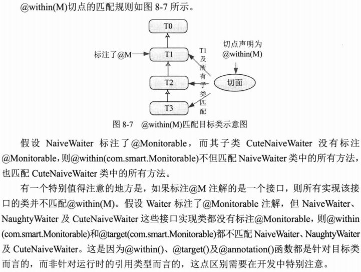

# 基于@AspectJ和Schema的AOP #

若基于Java5的项目，推荐使用Spring提供的@AspectJ配置方式，因为它能以更简单、更直接的方式应用切面

## Java5注解知识回顾 ##

注解是代码的附属信息，它遵循一个基本原则：注解不能直接干扰程序代码的运行，无论增加或是删除注解，代码都能正常运行。Java语言解释器会忽略这些注释，由第三方工具负责对注解进行处理。第三方工具可以利用代码中的注解间接控制程序代码的运行，它们通过Java反射机制读取注解信息，并根据这信息更改目标程序的逻辑，而这正是SpringAOP对@AspectJ提供支持所采取的方法

[一个简单的注解类](src/main/java/com/smart/anno/NeedTest.java)

[使用注解](src/main/java/com/smart/anno/ForumService.java)

[通过反射机制访问注解](src/test/java/com/smart/anno/ToolTest.java)

## 着手使用@Aspect ##

上一章分别使用Pointcut 和 Advice接口描述，并用Advisor整合二者描述切面，@AspectJ采用注解来描述切点、增强、二者只是表达方式不同，描述的本质是完全相同的。

### 准备工作 ###

- Java 5 注解
- asm模块轻量级的字节码处理框架，因为Java的反射机制无法获取入参数，Spring就利用asm处理@AspectJ中所有描述的方法入参名。
- Spring采用AspectJ提供的@AspectJ注解类库及相应的解析类库，需要找pom.xml文件中添加aspectj.weaver和aspectj.tools类包的依赖

### 简单的例子 ###

[目标类](src/main/java/com/smart/NaiveWaiter.java)

[一个有@AspectJ注解定义一个切面](src/main/java/com/smart/aspectj/example/PreGreetingAspect.java)

>曲径通幽去，禅房花木深

[通过AspectJProxyFactory为NaiveWaiter生成织入PreGreetingAspect**切面**的**代理**](src/test/java/com/smart/aspectj/example/AspectJProxyTest.java)

## 通过配置使用@AspectJ切面 ##

一般情况

	<!-- 将@AspectJ注解类自动织入目标Bean中 -->
	<bean class="org.springframework.aop.aspectj.annotation.AnnotationAwareAspectJAutoProxyCreator"/>

	<!--目标-->
	<bean id="waiter" class="com.smart.NaiveWaiter" />
	
	<!--切面-->
	<bean class="com.smart.aspectj.example.PreGreetingAspect" />

优雅模式，使用基于Schema的aop命名空间进行配置。

	<beans xmlns="http://www.springframework.org/schema/beans"
	xmlns:xsi="http://www.w3.org/2001/XMLSchema-instance"
	xmlns:aop="http://www.springframework.org/schema/aop"
	xsi:schemaLocation="http://www.springframework.org/schema/beans http://www.springframework.org/schema/beans/spring-beans-4.0.xsd
           http://www.springframework.org/schema/aop http://www.springframework.org/schema/aop/spring-aop-4.0.xsd">
	    <aop:aspectj-autoproxy/>
	    <!-- 注释
	    <bean class="org.springframework.aop.aspectj.annotation.AnnotationAwareAspectJAutoProxyCreator"/>
		-->
		
		<!--目标类和切面类照上-->
		
	</beans>

## @AspectJ语法基础 ##

AspectJ 5.0版本为准

### 切点表达式函数 ###

切点表示式 = 关键字 + 操作参数

**例**：

切点表示式：execution(* greetTo(..))

关键字：execution

操作参数：* greetTo(..)

Spring支持9种@AspectJ切点表达式函数，这些函数可分4类：

- 方法切点函数
- 方法入参函数
- 目标类切点函数
- 代理类切点函数

### 在函数入参中使用通配符 ###

@AspectJ支持三种通配符

@AspectJ函数按其是否支持通配符及支持的程度，可分为3类

### 逻辑运算符 ###

切点表达式由切点函数组成，切点函数之间还可以进行逻辑运算，组成复合切点。

&& and, || or, ! not 

	@Before("!target(com.smart.NaiveWaiter) "+
			"&& execution(* serveTo(..)))")
	public void notServeInNaiveWaiter() {}

	@After("within(com.smart.*) "
			+ " && execution(* greetTo(..)))")
	public void greeToFun() {}
	
	@AfterReturning("target(com.smart.Waiter) || "+
			        " target(com.smart.Seller)")
	public void waiterOrSeller(){}

### 不同增强类型 ###

1. @Before
2. @AfterReturning
3. @Around
4. @AfterThrowing
5. @After 一般用于资源释放，相当于try{}finally{}
6. @DeclareParents

### 引介增强用法 ###

	@Aspect
	public class EnableSellerAspect {
	   @DeclareParents(value="com.smart.NaiveWaiter",//为NaiveWaiter添加接口实现
			   defaultImpl=SmartSeller.class)//默认的接口实现类
	   public  Seller seller;//要实现的目标接口
	}

[引介增强来实现](src/main/java/com/smart/aspectj/basic/EnableSellerAspect.java)

[配置文件](src/main/resources/com/smart/aspectj/basic/beans.xml)

[运行测试类](src/test/java/com/smart/aspectj/basic/DeclaredParentsTest.java)

## 切点函数详解 ##

### @annotation() ###

它表示标注了**某个注解**的所有方法。

---

目标方法

	public class NaughtyWaiter implements Waiter {
	
		@NeedTest
		public void greetTo(String clientName) {
			System.out.println("NaughtyWaiter:greet to "+clientName+"...");
		}

	...

---

用@annotation()标注切面

    @AfterReturning("@annotation(com.smart.anno.NeedTest)")
    public void atAnnotaionTest(){
    	System.out.println("atAnnotaionTest() executed!");
    }

---

配置文件

    <aop:aspectj-autoproxy proxy-target-class="true"/>
	<bean id="naiveWaiter" class="com.smart.NaiveWaiter" />
	<bean id="naughtyWaiter" class="com.smart.NaughtyWaiter" />
	<bean class="com.smart.aspectj.fun.TestAspect" />

---

运行测试类

	@Test
	public void pointcut(){
		String configPath = "com/smart/aspectj/fun/beans.xml";
		ApplicationContext ctx = new ClassPathXmlApplicationContext(configPath);
		Waiter naiveWaiter = (Waiter) ctx.getBean("naiveWaiter");
		Waiter naughtyWaiter = (Waiter) ctx.getBean("naughtyWaiter");
		naiveWaiter.greetTo("John");
		
		//该方法被织入增强
		naughtyWaiter.greetTo("Tom");
	}

### execution() ###

execution()是最常用的切点函数

语法如下

	execution(<修饰符模式>?<返回类型模式><方法名模式>(参数模式)<异常模式>?)

<修饰符模式>、<异常模式>可有可无，其它的必须有

举例说明execution()语法

### args() ###

### @args() ###

### within() ###

通过类匹配模式声明切点

与execution()相比，within()所指定的连接点最小范围只是类，而execution()所指定的连接点可以大到包，小到方法入参。

从某种意义上，execution()函数的功能涵盖了within()函数功能。

	within(<类匹配模式>)

### @within() ###

@within(M)匹配标注了@M的类及子孙类

### @target() ###

@target(M)匹配任意标注了@M的目标类

### target() ###

它通过判断**目标类**是否按类型匹配指定类来决定**连接点**是否匹配

### this() ###

它通过判断**代理类**是否按类型匹配指定类来决定是否和**切点**匹配

它与Spring官档描述有出入

和target()的区别

细微区别通过实例说明

[定义一个引介切面](src/main/java/com/smart/aspectj/fun/EnableSellerAspect.java)

一个实现类

	public class SmartSeller implements Seller {
	
		public int sell(String goods,String clientName) {
			System.out.println("SmartSeller: sell "+goods +" to "+clientName+"...");
			return 100;
		}
	...

通过this指定切点

	@AfterReturning("this(com.smart.Seller)")
	public void thisTest(){
		System.out.println("thisTest() executed!");
	}

---

配置文件

    <aop:aspectj-autoproxy proxy-target-class="true"/>
	<bean id="naiveWaiter" class="com.smart.NaiveWaiter" />
	<bean class="com.smart.aspectj.fun.TestAspect" />
	<bean class="com.smart.aspectj.fun.EnableSellerAspect"/>

---

运行测试类

	@Test
	public void pointcut(){
		String configPath = "com/smart/aspectj/fun/beans.xml";
		ApplicationContext ctx = new ClassPathXmlApplicationContext(configPath);
		Waiter naiveWaiter = (Waiter) ctx.getBean("naiveWaiter");
		//Waiter naughtyWaiter = (Waiter) ctx.getBean("naughtyWaiter");
		naiveWaiter.greetTo("John");
		naiveWaiter.serveTo("John");
		((Seller)naiveWaiter).sell("Beer", "John");		

---

运行结果

	NaiveWaiter:greet to John...
	thisTest() executed!
	
	NaiveWaiter:serving John...
	thisTest() executed!
	
	//同时织入两切面
	SmartSeller: sell Beer to John...
	thisTest() executed!

## @AspectJ进阶 ##

### 切点复合运算 ###

&& and, || or, ! not 

[请移步至逻辑运算符](#逻辑运算符)

### 命名切点 ###

通过@Pointcut注解及切面类方法对切点进行命名，这样其他地方重用

[切点命名](src/main/java/com/smart/aspectj/advanced/TestNamePointcut.java)

	public class TestNamePointcut {
		@Pointcut("within(com.smart.*)")
		private void inPackage(){}
		
		@Pointcut("execution(* greetTo(..)))")
	    protected void greetTo(){}
	
	    @Pointcut("inPackage() and greetTo()")
	    public void inPkgGreetTo(){}
	}

---

	@Before("TestNamePointcut.inPkgGreetTo()")
	public void pkgGreetTo(){
		System.out.println("--pkgGreetTo() executed!--");
	}

	@Before("!target(com.smart.NaiveWaiter) && "
			+"TestNamePointcut.inPkgGreetTo()")
	public void pkgGreetToNotNaiveWaiter(){
		System.out.println("--pkgGreetToNotNaiveWaiter() executed!--");
	}

### 增强织入的顺序 ###

### 访问连接点信息 ###

AspectJ使用JoinPoint接口表示目标类连接点对象，ProceedingJoinPoint表示连接点对象

    //------------访问连接点对象----------//
	@Around("execution(* greetTo(..)) && target(com.smart.NaiveWaiter)")
	public void joinPointAccess(ProceedingJoinPoint pjp) throws Throwable{
		System.out.println("------joinPointAccess-------");
		System.out.println("args[0]:"+pjp.getArgs()[0]);		
		System.out.println("signature:"+pjp.getTarget().getClass());
		pjp.proceed();//通过连接点执行目标对象方法
		System.out.println("-------joinPointAccess-------");
	}

[配置文件](src/main/resources/com/smart/aspectj/advanced/beans.xml)

[运行测试类](src/test/java/com/smart/aspectj/advanced/AdvancedTest.java)

### 绑定连接点方法入参 ###

args()、this()、target()、@args、@within()、@target和@annotation()这7个函数除了可以指定类名外，还可以指定参数名，将目标对象连接点上的方法入参绑定到增强的方法中。

	@Before("target(com.smart.NaiveWaiter) && args(name,num,..)")
	public void bindJoinPointParams(int num,String name){
	   System.out.println("----bindJoinPointParams()----");
	   System.out.println("name:"+name);
	   System.out.println("num:"+num);
	   System.out.println("----bindJoinPointParams()----");
	}

### 绑定代理对象 ###

使用this()或target()函数可绑定被代理对象实例，在通过类实例名绑定对象时，依然具有原来连接点匹配的功能，只不过类名是通过增强方法中同名入参的类型间接决定罢了。

	@Before("this(waiter)")
	public void bindProxyObj(Waiter waiter){
	   System.out.println("----bindProxyObj()----");
	   System.out.println(waiter.getClass().getName());
	   System.out.println("----bindProxyObj()----");
	}

### 绑定类注解对象 ###

@within()和@target函数可以将目标类的注解对象绑定到增强方法中

	@Before("@within(m)")
	public void bindTypeAnnoObject(Monitorable m){
	   System.out.println("----bindTypeAnnoObject()----");
	   System.out.println(m.getClass().getName());
	   System.out.println("----bindTypeAnnoObject()----");
	}

### 绑定抛出的异常 ###

	@AfterReturning(value="target(com.smart.SmartSeller)",returning="retVal")
	public void bingReturnValue(int retVal){
	   System.out.println("----bingReturnValue()----");
	   System.out.println("returnValue:"+retVal);
	   System.out.println("----bingReturnValue()----");
	}

## 基于Schema配置切面 ##

也就是 基于@AspectJ注解的切面，本质上是将切点、增强类型的信息使用注解进行藐视，现在把这两信息移步到Schema的XML配置文件

[示例](src/main/resources/com/smart/schema/beans.xml)

	<beans ...>
		<aop:config proxy-target-class="true">
		
			<!-- Advisor是Spring中切面概念的 对应物，是切点和增强的复合体，不过
			它仅包含一个切点和一个增强。在AspectJ中没有对应的等价物，在AOP Schema配置样式中，可以通过<aop:advisor>配置一个Advisor-->
		    <aop:advisor advice-ref="testAdvice"  
		    	pointcut="execution(* com..*.Waiter.greetTo(..))"/>  
			
			<aop:aspect ref="adviceMethods">
			
				<aop:before method="preGreeting"
					pointcut="target(com.smart.NaiveWaiter) and args(name)"
					arg-names="name" />
			
				<aop:after-returning method="afterReturning"
					pointcut="target(com.smart.SmartSeller)" returning="retVal" />
			
				<aop:around method="aroundMethod"
					pointcut="execution(* serveTo(..)) and within(com.smart.Waiter)" />
			
				<aop:after-throwing method="afterThrowingMethod"
					pointcut="target(com.smart.SmartSeller) and execution(* checkBill(..))"
					throwing="iae" />
			
				<aop:after method="afterMethod"
					pointcut="execution(* com..*.Waiter.greetTo(..))" />
			
				<aop:declare-parents
					implement-interface="com.smart.Seller"
					default-impl="com.smart.SmartSeller"
					types-matching="com.smart.Waiter+" />
	        
	        	<!-- 绑定连接点信息 -->
	            <aop:before method="bindParams" 
	                   pointcut="target(com.smart.NaiveWaiter) and args(name,num,..)"/>
			</aop:aspect>
		</aop:config>

		<!-- Spring Advice增强 -->
	    <bean id="testAdvice" class="com.smart.schema.TestBeforeAdvice"/>
		
		<!-- 增强方法 -->
		<bean id="adviceMethods" class="com.smart.schema.AdviceMethods" />

		<bean id="naiveWaiter" class="com.smart.NaiveWaiter" />
		<bean id="naughtyWaiter" class="com.smart.NaughtyWaiter" />
		<bean id="seller" class="com.smart.SmartSeller" />
	</beans>

[运行测试类](src/test/java/com/smart/schema/SchemaAspectTest.java)

### 各种切面类型总结 ###

## LTW ##

除了运行期织入切面的方式外，还可以在类加载期通过字节码编辑技术将切面织入目标类，这种织入方式成为LTW(Load Time Weaving)

