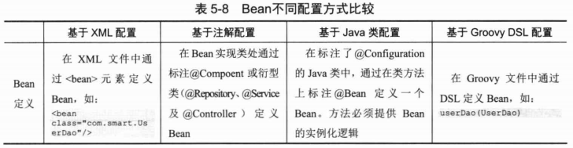

# IoC容器中装配Bean #

## Spring配置概述 ##

### Spring容器高层视图 ###

Bean配置信息是Bean的元数据信息

- Bean的实现类
- Bean的属性信息，如数据源的连接数、用户数、密码等
- Bean的依赖关系，Spring根据依赖关系配置完成Bean之间的装配
- Bean的行为配置，如生命周期范围及生命周期各过程的回调函数等

### 基于XML的配置 ###

## Bean的基本配置 ##

### 装配一个Bean ###

	<bean id="boss" class="com.smart.simple.Boss"></bean>

### Bean命名 ###

id要唯一，name可重复，缺省的将要使用 全限定名

最好老老实实用id

## 依赖注入 ##

### 属性注入 ###

指通过setXxx()方法注入Bean的属性值或依赖对象。可选择和灵活的优点，最常用的注入方式

#### 属性注入实例 ####

	<bean id="car" class="com.smart.ditype.Car">
		<property name="brand" value="红旗&amp;CA72"/>
		<property name="maxSpeed" value="200"/>
		<property name="price" value="20000.00"/>
	</bean>

#### JavaBean关于属性命名的特殊规范 ####

变量前两个字母要么全部大写，要么全部小写

合法: IDCode、IC、brand
不合法: iC、iCcard、iDCode

### 构造函数注入 ###

#### 按类型匹配入参 ####

	<bean id="car1" class="com.smart.ditype.Car">
		<constructor-arg type="java.lang.String">
			<value>红旗CA72</value>
		</constructor-arg>
		<constructor-arg type="double">
			<value>20000</value>
		</constructor-arg>
	</bean>

#### 按索引匹配入参 ####

若有参数的类型相同时，用上述方法不好使

	<bean id="car2" class="com.smart.ditype.Car">
		<constructor-arg index="0" value="红旗CA72" />
		<constructor-arg index="1" value="中国一汽" /> 
		<constructor-arg index="2" value="20000" />
	</bean>

#### 联合使用类型和索引匹配入参 ####

	<bean id="car3" class="com.smart.ditype.Car">
		<constructor-arg index="0" type="java.lang.String">
			<value>红旗CA72</value>
		</constructor-arg>
		<constructor-arg index="1" type="java.lang.String">
			<value>中国一汽</value>
		</constructor-arg>
		<constructor-arg index="2" type="int">
			<value>200</value>
		</constructor-arg>
	</bean>

#### 通过自身类型反射匹配入参 ####

	<bean id="boss1" class="com.smart.ditype.Boss">
		<constructor-arg>
			<value>John</value>
		</constructor-arg>
		<constructor-arg>
			<ref bean="car" />
		</constructor-arg>
		<constructor-arg>
			<ref bean="office" />
		</constructor-arg>
	</bean>
	<bean id="office" class="com.smart.ditype.Office" />

#### 循环依赖问题 ####

用属性设置注入

### 工厂方法注入 ###

	public class CarFactory {
	   public Car createHongQiCar(){
		   Car car = new Car();
		   car.setBrand("红旗CA72");
		   return car;
	   }
	   
	   public static Car createCar(){
		   Car car = new Car();
		   return car;
	   }
	}

#### 非静态工厂方法 ####

	<bean id="carFactory" class="com.smart.ditype.CarFactory" />
	<bean id="car5" factory-bean="carFactory" factory-method="createHongQiCar">
	</bean>

#### 静态工厂方法 ####

	<bean id="car6" class="com.smart.ditype.CarFactory" factory-method="createCar"/>

### 选择注入方式的考量 ###

Spring提供了3种注入方式

- 属性注入(最常用)
- 构造器注入
- 工厂方法注入

该选哪种?Follow your heart.怂

## 注入参数详解 ##

### 字面值 ###

所谓“字面值”一般是指可用字符串表示的值，这些值可通过<value&gt;注入

注意XML的特殊实体字符

### 引用其他Bean ###

	<bean id="boss2" class="com.smart.ditype.Boss">
		<property name="car" ref="car" />
	</bean>

---

	<bean id="boss" class="com.smart.attr.Boss">
		<property name="car" >
			<ref parent="car" />
		</property>
	</bean>

### 内部Bean ###

	<bean id="boss2" class="com.smart.attr.Boss">
		<property name="car">
			<bean class="com.smart.attr.Car">
				<property name="maxSpeed" value="200" />
				<property name="price" value="2000.00" />
			</bean>
		</property>
	</bean>

### null值 ###

<null&gt;

### 级联属性 ###

	<bean id="foo" class="foo.Bar">
	    <property name="fred.bob.sammy" value="123" />
	</bean>

### 集合类型属性 ###

#### List ####

	<bean id="boss1" class="com.smart.attr.Boss">
		<property name="car" ref="car" />
		<property name="favorites">
			<list>
				<value>看报</value>
				<value>赛车</value>
				<value>高尔夫</value>
			</list>
		</property>
	</bean>

#### Set ####

	<bean id="boss1" class="com.smart.attr.Boss">
		<property name="car" ref="car" />
		<property name="favorites">
			<set>
				<value>看报</value>
				<value>赛车</value>
				<value>高尔夫</value>
			</set>
		</property>
	</bean>

#### Map ####

	<bean id="boss1" class="com.smart.attr.Boss">
		<property name="jobs">
			<map>
				<entry >
					<key>
						<value>AM</value>
					</key>
					<value>会见客户</value>
				</entry>
				<entry>
					<key>
						<value>PM</value>
					</key>
					<value>公司内部会议</value>
				</entry>
			</map>
		</property>
	</bean>

#### Properties ####

	public class Boss {
		private Properties mails = new Properties();

		...
---

	<property name="mails">
		<props>
			<prop key="jobMail">john-office@smart.com</prop>
			<prop key="lifeMail">john-life@smart.com</prop>
		</props>
	</property>

#### 强类型集合 ####

	private Map<String, Integer> jobTime = new HashMap<String, Integer>();

---

	<property name="jobTime">
		<map>
			<entry>
				<key>
					<value>会见客户</value>
				</key>
				<value>124</value>
			</entry>
		</map>
	</property>

#### 集合合并 ####

	<bean id="parentBoss" abstract="true"
		class="com.smart.attr.Boss">
		<property name="favorites">
			<set>
				<value>看报</value>
				<value>赛车</value>
				<value>高尔夫</value>
			</set>
		</property>
	</bean>
	<bean id="childBoss" parent="parentBoss">
		<property name="favorites">
			<set merge="true">
				<value>爬山</value>
				<value>游泳</value>
			</set>
		</property>
	</bean>	

#### 通过util命名空间配置集合类型的Bean ####

	<util:list id="favoriteList1" list-class="java.util.LinkedList">
		<value>看报</value>
		<value>赛车</value>
		<value>高尔夫</value>
	</util:list>

	<util:set id="favoriteSet1"  >
		<value>看报</value>
		<value>赛车</value>
		<value>高尔夫</value>
	</util:set>

### 简化配置 ###

#### 使用p命名空间 ####

	p:<属性名>="xxx"

引用对象

	p:<属性名>-ref="xxx"

### 自动装配 ###

&lt;bean&gt; 的属性 autowire="&lt;自动装配类型&gt;"

自动装配用得好就能四两拨千斤

在实际开发中，XML配置方式很少启用自动装配功能，而基于注解的配置方式默认采用byType自动装配策略

## 方法注入 ##

Spring需要用到CGLib

### lookup方法注入 ###

实现一接口

	public interface MagicBoss {
	   Car getCar(); 
	}

---

	<bean id="car" class="com.smart.injectfun.Car"
	    p:brand="红旗CA72" p:price="2000" scope="prototype"/>
	
	<bean id="magicBoss" class="com.smart.injectfun.MagicBoss" >
		<lookup-method name="getCar" bean="car"/>
	</bean>

不用不编写任何实现类，仅通过配置为该接口提供动态的实现

### 方法替换 ###

	<bean id="boss2" class="com.smart.injectfun.Boss2"/>
	
	<bean id="boss1" class="com.smart.injectfun.Boss1">
	 <replaced-method name="getCar" replacer="boss2"/>
	</bean>

---

	public class Boss2 implements MethodReplacer {
		public Object reimplement(Object arg0, Method arg1, Object[] arg2)
				throws Throwable {
			Car car = new Car();
			car.setBrand("美人豹");
			return car;
		}
	}

---

	public class Boss1 implements MagicBoss{
	
		public Car getCar() {
			Car car = new Car();
			car.setBrand("宝马Z4");
			return car;
		}
	}

当容器中返回boss1 Bean并调用其getCar()方法时，将返回一辆“美人豹Car”

上述招式阳春白雪，属性注入、构造函数注入等下里巴人

## &lt;bean&gt;之间的关系 ##

### 继承 ###

	<bean id="abstractCar" class="com.smart.tagdepend.Car"
	      p:brand="红旗CA72" p:price="2000.00" p:color="黑色"
	      abstract="true"/>
	      
	<bean id="car3" parent="abstractCar">
		<property name="color" value="红色"/>
	</bean>
	<bean id="car4" parent="abstractCar" >
		<property name="color" value="白色"/>
	</bean>

### 依赖 ###

一般使用&lt;ref&gt;完成依赖
	

	public class CacheManager {
	   public CacheManager(){
		   Timer timer = new Timer();
		   TimerTask cacheTask = new CacheTask();
		   timer.schedule(cacheTask,0,SystemSettings.REFRESH_CYCLE*1000);  
	   }
	}

---

	public class SystemSettings {
	   public static int SESSION_TIMEOUT = 30;
	   public static int REFRESH_CYCLE = 60;
	}

---

	public class SysInit {
	   public SysInit(){  
		   System.out.println("SysInit");
		   //模拟从数据库中加载系统设置信息
		   SystemSettings.REFRESH_CYCLE = 100;
		   SystemSettings.SESSION_TIMEOUT = 10;
	   }
	}

---

	<bean id="cacheManager" class="com.smart.tagdepend.CacheManager" depends-on="sysInit" />
	<bean id="sysInit" class="com.smart.tagdepend.SysInit" />

通过depends-on属性将sysInit指定为manager前置依赖的Bean，这样就可以**保证**manager Bean在实例化并运行时所引用的系统参数是**最新**的设置值

### 引用 ###

&lt;idref&gt;会比一般的bean引用强，启动Spring容器会检测idref的的可靠性

## 整合多个配置文件 ##

    <import resource="classpath:com/smart/impt/beans1.xml"/>
	<bean id="boss1" class="com.smart.fb.Boss"
	   p:name="John" p:car-ref="car1"/>
	<bean id="boss2" class="com.smart.fb.Boss"
	   p:name="John" p:car-ref="car2"/>

## Bean作用域 ##

scope=""

WebApplicationContext所有使用的范围（request、session、globalSession）需要另外地配置

一般情况下，无状态或者状态不可变的类适合使用**单例模式**singleton

在默认情况下，Spring的ApplicationContext容器在启动时，自动实例化所有singleton的Bean并缓存于容器中。虽启动耗时，但一举两得，其一，Bean提前进行实例化操作会及早发现一些潜在的问题，其二，Bean以缓存的方式保存，当运行时用到该Bean就无须再实例化，提高效率。

### 作用域依赖问题 ###

若Web相关作用域的Bean注入singleton或prototype的bean，需引入&lt;aop:scoped-proxy/&gt;

## FactoryBean ##

Spring为此提供一个org.springframework.beans.factory.FactoryBean工厂类借口，用户可以通过实现该工厂类接口定制实例化Bean的逻辑

[示例](src/main/java/com/smart/fb/CarFactoryBean.java)

	<bean id="car1" class="com.smart.fb.CarFactoryBean"
	      p:carInfo="红旗CA72,200,20000.00"/>

当调用getBean("car")时，Spring通过反射机制发现CarFactoryBean实现了FactoryBean的接口，这时Spring容器就调用接口方法CarFactory#getObject()返回工厂类创建的对象

## 基于注解配置 ##

使用注解定义

@Component
@Repository
@Service
@Controller

### 扫描注解定义Bean ###

	<context:component-scan base-package="com.lun"/>

可在该基础上进行详细的过滤配置

### 自动装配Bean ###

@Autowired
@Qualifier指定注入Bean的名称

@Lazy

@Resource和@Inject 是标准规范，相当于@Component和@Autowired

### Bean作用范围及生命过程 ###

@Scope("prototype")

@PostConstruct

@PreDestory

## 基于Java类配置 ##

[基于Java提供Bean定义信息](src/main/java/com/smart/conf/AppConf.java)

[使用基于Java类的配置信息启动Spring容器](src/main/java/com/smart/conf/JavaConfigTest.java)

## 基于Groovy DSL的配置 ##

Groovy是一种基于JVM的敏捷开发语言，它结合了Python、Ruby等动态特性。Groovy代码能够与Java代码很好地结合，也能用于扩展现有的代码。由于其运行在JVM的特性，所以Groovy可以使用其他Java语言编写的库

[使用Groovy DSL提供Bean定义信息](src/main/resources/com/smart/groovy/spring-context.groovy)

[使用GenericGroovyApplicationContext启动Spring容器](src/test/java/com/smart/groovy/LogonServiceTest.java)

## 通过编码方式动态添加Bean ##

[通过编码方式动态添加Bean](src/main/java/com/smart/dynamic/UserServiceFactoryBean.java)

### 扩展自定义标签 ###

在开发产品级组件的时候，为了更好地封装、增强组件的应用性，一般都将之间进行标签化定义(如Dubbo，Rop)

自定义的步骤：

1. 采用XSD描述自定义标签的元素属性
2. 编写Bean定义的解析器
3. 注册自定义标签解析器
4. 绑定命名空间解析器

[1. 采用XSD描述自定义标签的元素属性](src/main/resources/com/smart/schema/userservice.xsd)

[2. 编写Bean定义的解析器](src/main/java/com/smart/dynamic/UserServiceDefinitionParser.java)

[3. 注册自定义标签解析器](src/main/java/com/smart/dynamic/UserServiceNamespaceHandler.java)

[4. 绑定命名空间解析器 1](src/main/resources/META-INF/spring.handlers)

[   绑定命名空间解析器 2](src/main/resources/META-INF/spring.schemas)

[最后使用自定义标签](src/main/resources/com/smart/dynamic/custom.xml)

## 不同配置方式比较 ##

一般采用XML配置DataSource、SessionFactory等资源Bean，在XML中利用aop、context命名空间进行相关主题的配置。

其他所有项目中开发的Bean都基于注解配置的方式进行配置，即整个项目采用基于XML+基于注解的配置方式，很少用基于Java类的配置信息。

