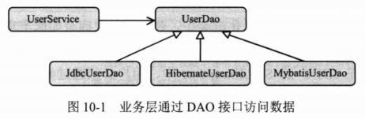
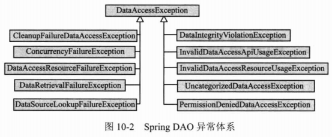
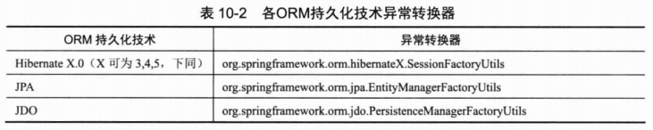
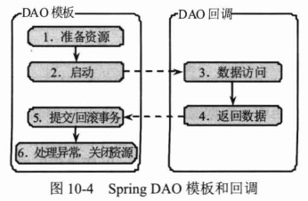
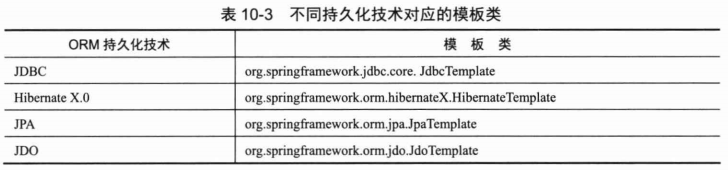

# Spring对DAO的支持 #

## SpringDAO理念 ##

Spring本质上希望以统一的方式整合底层的持久化技术，即以统一的方式进行调用及事务管理，避免让具体的实现侵入到业务层的代码中。由于每种持久化技术都有各自的异常体系，所以Spring提供了统一的异常体系，使不同异常体系的阻抗得以消弭，方便定义出和具体实现技术无关的DAO接口。

## SpringDAO异常体系 ##

SQLErrorCodeSQLExceptionTranslator和SQLStateSQLException分别负责处理SQLException中错误码和SQL状态码的翻译工作。

Spring支持MyBatis ORM持久化技术，由于MyBatis抛出异常和JDBC相同的SQLException异常，所以直接采用和JDBC相同的异常转换器。

## 统一数据访问模板 ##

Spring为支持的持久化技术分别提供了模板访问的方式，降低了使用各种持久化技术的难度，因此可以大幅度提高开发效率。

JDBC数据访问操作按以下流程进行

1. 准备资源
2. 启动事务
3. 在事务中执行具体的数据访问操作
4. 提交/回滚事务
5. 关闭资源，处理异常

这样写代码太过陈词滥调了。

Spring将这个相同的数据访问流程固化到模板类中，并将数据访问中固定和变化的部分分开，同时保证模板是线程安全的，以便多个数据访问线程共享同一个模板实例。

## 数据源 ##

### 配置一个数据源 ###

1.Apache的DBCP

	<context:property-placeholder location="classpath:jdbc.properties"/>
	<bean id="originDataSource" class="org.apache.commons.dbcp.BasicDataSource"
		destroy-method="close" 
		p:driverClassName="${jdbc.driverClassName}"
		p:url="${jdbc.url}" 
		p:username="${jdbc.username}"
		p:password="${jdbc.password}"/>

2.C3P0

### 获取JNDI数据源 ###

如果应用配置在高性能的应用服务器（如WebLogic和WebSphere等）上，则可能希望使用应用服务器本身提供的数据源。

应用服务器的数据源使用JNDI开放调用者使用，Spring为此专门提供了引用JNDI数据源JndiObjectFactoryBean类

### Spring的数据源实现类 ###

Spring本身也提供一个简单的数据源实现类DriverManagerDataSource，没有实现池化连接机制。这个数据源类比较适合在单元测试或简单的独立应用中使用

