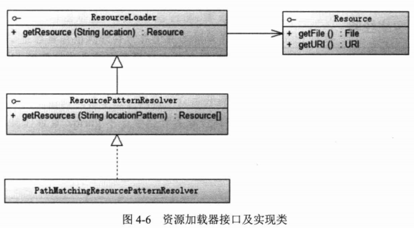

# IoC容器 #

## IoC概述 ##

### IoC的大概意思 ###
对于软件来说，即某一接口具体实现类的选择控制权从调用类中移除，转交给第三方决定，即由Spring容器借由Bean配置来进行控制。

另一个名字：依赖注入Dependency Injection
让调用类对某一接口实现类的依赖关系由第三方（容器或协作类）注入

### IoC类型 ###

- 构造函数注入
- 属性setter注入
- 接口注入（太麻烦，需另建接口，不建议使用）

### 通过容器完成依赖关系的注入 ###

也就是通过Spring

## Spring 相关信息 ##

### 简单示例 ###

Java允许通过程序化的方式**间接**对Class的对象实例操作--反射

[反射应用实例](src/main/java/com/smart/reflect/ReflectTest.java)

### 类装载器ClassLoader ###

类装载器就是寻找类的字节码文件并构造出类在JVM内部表示的对象的组件。

把类装入的步骤

1. 装载：查找和导入Class文件
2. 连接：
	- 校验：检查载入Class文件数据的正确性
	- 准备：给类的静态变量分配存储空间
	- 解析：将符号引用转成直接引用
3. 初始化：对类的静态变量、静态代码块执行初始化工作

类装载工作由ClassLoader及其子类负责

JVM运行产生3个ClassLoader:

1. 根装载器 由C++编写，不是ClassLoader子类，Java中不可见，负责JRE的核心类库，如rt.jar
2. ExtClassLoader ClassLoader的子类，负责装载JRE扩展目录ext中的JAR类包
3. AppClassLoader负责装载Classpath路径类库

### Java反射机制 ###

Class反射对象描述类语义结构，可从Class对象中获取Constructor、Method、Field的反射对象，并以编程的方式通过这些反射对象对目标类对象进行操作。

通过反射机制，甚至可以访问私有变量，私有方法

[通过反射机制设置第三方类的非公有域，调用非公有方法](src/main/java/com/smart/reflect/PrivateCarReflect.java)

## 资源访问利器 ##

### 资源抽象接口 ###

Resources在Spring框架中起着不可或缺的作用，Spring框架使用Resource装载各种资源，这些资源包括配置文件资源，国际化属性文件资源。

Spring的Resource接口及实现类可以在脱离Spring框架的情况下使用，它比通过JDK访问资源的API更好更强大 (直接加入Spring-core jar包即可使用)

[示例一](src/main/java/com/smart/resource/FileSourceExample.java)

[示例二](src/main/java/com/smart/resource/EncodedResourceExample.java)

### 资源加载 ###

为了访问不同类型的资源，必须使用相应的Resource实现类，比较**麻烦**

Spring提供通过**资源地址前缀**识别不同资源类型

#### 1.资源地址表达式 ####

另外资源地址支持3种Ant风格匹配符

1. ？ 匹配一个字符
2. \* 匹配任意字符
3. \*\* 匹配多层路径

#### 2.资源加载器 ####

通过实现PathMatchingResourcePatternResolver来使用 **资源地址表达式**

[示例程序](src/main/java/com/smart/resource/Resolver.java)

>打包时，用Resource#getInputStream代替使用Resource#getInputStream，否则会抛出FileNotFoundException

## BeanFactory和ApplicationContext ##

Spring通过配置文件描述Bean与Bean之间的**依赖关系**，利用Java语言的反射功能实例化Bean并建立Bean之间的依赖关系。（IoC的实现原理）

Spring的IoC容器在完成这些底层工作的基础上，还提供
1. Bean实例缓存
2. 生命周期管理
3. Bean实例代码
4. 事件发布
5. 资源装载
...
高等服务

BeanFactory是Spring框架最核心的借口，他提供高级IoC配置机制。

BeanFactory使管理不同类型的Java对象成为可能，ApplicationContext(继承BeanFactory)建立在BeanFactory基础上提供更多功能，它提供**国际化支持**和**框架事件体系**

BeanFactory(IoC容器)是Spring框架的基础设施，面向Spring本身

ApplicationContext(Spring容器)面向适应Spring框架的开发者

### BeanFactory介绍 ###

Spring的Bean比JavaBean更加广泛

#### BeanFactory的类体系结构 ####

Bean建议使用XmlBeanDefinitionReader、DefaultListableBeanFactory实现

#### 初始化BeanFactory ####

[使用BeanFactory](src/main/java/com/smart/beanfactory/BeanFactoryTest.java)

对于单实例(singleton)的bean来说，BeanFactory会缓存Bean实例，所以第二次使用getBean()获取Bean时，将直接从IoC容器的缓存中获取Bean实例。

Spring在DefaultSingletonBeanRegistry类中提供一个用于缓存器，它是一个HashMap实现的缓存器，单实例Bean以beanName为键保存在这个HashMap中

### ApplicationContext介绍 ###

#### ApplicationContext体系结构 ####

ApplicationContext通过FileSystemXmlApplicationContext或ClassPathXmlApplicationContext

[ClassPathXmlApplicationContext启动Spring容器](src/main/java/com/smart/context/ApplicationContextTest.java)

---

[使用注解代替xml进行配置](src/main/java/com/smart/context/Beans.java)

[AnnotationConfigApplicationContext启动Spring容器](src/main/java/com/smart/context/AnnotationApplicationContext.java)

---

Spring 4.0支持使用Groovy DSL进行Bean定义配置

//TODO:查询Groovy相关数据

#### WebApplicationContext体系结构 ####

WebApplicationContext是专门为Web应用准备的，它允许相对于Web根目录的路径中装载文件完成初始化工作

WebApplicationContext通过配置web.xml启动，启动方式有两个

- org.springframework.web.context.ContextLoaderServlet
- org.springframework.web.context.ContextLoaderListener

### 父子容器 ###

通过HierachicalBeanFactory接口，Spring的IoC容器可以建立父子层级的容器体系，子容器可访问父容器中的Bean，但父容器不能访问子容器中的Bean

## Bean的生命周期 ##

