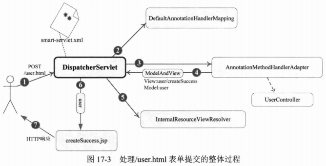

# Spring MVC #

## Spring MVC概述 ##

### 配置DispatchcerServlet ###

#### 配置DispatchcerServlet，截取特定的URL 请求####

/WEB-INF/web.xml

	<?xml version="1.0" encoding="UTF-8"?>
	<web-app version="2.5" xmlns="http://java.sun.com/xml/ns/javaee"
		xmlns:xsi="http://www.w3.org/2001/XMLSchema-instance"
		xsi:schemaLocation="http://java.sun.com/xml/ns/javaee 
		http://java.sun.com/xml/ns/javaee/web-app_2_5.xsd">
		
		<!-- 1.业务层和持久层的Spring配置文件 -->
		<context-param>
			<param-name>contextConfigLocation</param-name>
			<param-value>classpath:/applicationContext.xml</param-value>
		</context-param>
		<listener>
			<listener-class>org.springframework.web.context.ContextLoaderListener</listener-class>
		</listener>
	
		<!-- 2.声明DispatcherServlet，默认自动加载/WEB-INF/<servlet-Name>-servlet.xml的Spring配置文件，启动Web层的Spring容器 -->
		<servlet>
			<servlet-name>smart</servlet-name>
			<servlet-class>org.springframework.web.servlet.DispatcherServlet</servlet-class>
			<load-on-startup>1</load-on-startup>
		</servlet>
	
		<!-- 3.名为Dispatcher匹配的URL的模式 -->
		<servlet-mapping>
			<servlet-name>smart</servlet-name>
			<url-pattern>/</url-pattern>
		</servlet-mapping>
	
	</web-app>

Spring容器间可设置为父子级的关系，以实现良好的解耦。在这里，“Web层”Spring容器将作为“业务层”Spring容器的子容器，即“Web容器”可以引用“业务层”容器的Bean，而“业务层”容器却访问不到“Web容器”的Bean。

一个web.xml可以配置多个DispatcherServlet

可以通过常用的一些配置参数，可通过&lt;servlet&gt;的&lt;init-param&gt;指定。

Servlet3.0环境下可使用编程方式来配置Servlet容器。

#### 探究DispatcherServlet内部逻辑 ####

问题：Spring如何将上下文中的Spring MVC组件装配到DispatcherServlet中?

	protected void initStrategies(ApplicationContext context) {
		initMultipartResolver(context);
		initLocaleResolver(context);
		initThemeResolver(context);
		initHandlerMappings(context);
		initHandlerAdapters(context);
		initHandlerExceptionResolvers(context);
		initRequestToViewNameTranslator(context);
		initViewResolvers(context);
		initFlashMapManager(context);
	}

initStrategies()方法将在WebApplicationContext初始化后自动执行，此时Spring上下文中的Bean已经初始化完毕。该方法的工作原理是：通过反射机制查找并装配Spring容器中用户显式自定义的组件Bean，若无，则装配默认的组件实例。

在org/springframework/web/servlet/DispatcherServlet.properties指定了DispatcherServlet所使用的默认组件。

若用户希望采用非默认类型的组件，则只需在Spring配置文件中配置自定义的组件Bean即可。

### 一个简单的示例 ###

**1.编写处理请求的控制器**

	@Controller
	@RequestMapping("/user")
	public class UserController {
	
	
		@RequestMapping(value = "/register")
		public String register() {
			return "user/register";
		}
	...

**2.编写视图对象**

[用户注册页面](src/main/webapp/WEB-INF/views/user/register.jsp)

UserController添加一个createUser()方法用于处理表单提交的请求

	@Controller
	@RequestMapping("/user")
	public class UserController {

		@RequestMapping(method = RequestMethod.POST)
		public ModelAndView createUser(User user) {
			userService.createUser(user);
			ModelAndView mav = new ModelAndView();
			mav.setViewName("user/createSuccess");
			mav.addObject("user", user);
			return mav;
		}
	...
	
[创建成功页面](src/main/webapp/WEB-INF/views/user/createSuccess.jsp)

**3.配置Spring MVC的配置文件**

[配置文件](src/main/webapp/WEB-INF/smart-servlet.xml)

    <context:component-scan base-package="com.smart.web"/>

    <bean class="org.springframework.web.servlet.view.InternalResourceViewResolver"
          p:order="100" p:viewClass="org.springframework.web.servlet.view.JstlView"
          p:prefix="/WEB-INF/views/" p:suffix=".jsp"/>

### 4.总结 ###

## 注解驱动的控制器 ##

### 使用@RequestMapping映射请求 ###

#### 通过请求URL进行映射的 ####

	@Controller
	@RequestMapping("/user")
	public class UserController {
	
	
		@RequestMapping(value = "/register")
		public String register() {
			return "user/register";
		}

URL中的{xxx}占位符可以通过@PathVariable{"xxx"}绑定到操作方法的入参中。

	 @RequestMapping(value="/{userId}")
	 public ModelAndView showDetail(@PathVariable("userId") String userId){
		 ModelAndView mav = new ModelAndView();
		 mav.setViewName("user/showDetail");
		 mav.addObject("user", userService.getUserById(userId));
		 return mav;
	 }

#### 通过请求参数、请求方法或请求头进行映射 ####

	@RequestMapping(value = "/delete", method = RequestMethod.POST, params = "userId")
	public String test1(@RequestParam("userId") String userId) {
		// do sth
		return "user/test1";
	}

	@RequestMapping(value = "/show", headers = "content-type=text/*")
	public String test2(@RequestParam("userId") String userId) {
		// do sth
		return "user/test2";
	}

### 请求处理方法签名概述 ###

几种典型的处理方法

	// ①请求参数按名称匹配的方式绑定到方法入参中，方法返回对应的字符串代表逻辑视图名
	@RequestMapping(value = "/handle1")
	public String handle1(@RequestParam("userName") String userName,
			@RequestParam("password") String password,
			@RequestParam("realName") String realName) {
		return "success";
	}

	// ②将Cooke值及报文头属性绑定到入参中、方法返回ModelAndView
	@RequestMapping(value = "/handle2")
	public ModelAndView handle2(@CookieValue("JSESSIONID") String sessionId,
			@RequestHeader("Accept-Language") String accpetLanguage) {
		ModelAndView mav = new ModelAndView();
		mav.setViewName("success");
		mav.addObject("user", new User());
		return mav;
	}

	// ③请求参数按名称匹配的方式绑定到user的属性中、方法返回对应的字符串代表逻辑视图名
	@RequestMapping(value = "/handle3")
	public String handle3(User user) {
		return "success";
	}

	// ④直接将HTTP请求对象传递给处理方法、方法返回对应的字符串代表逻辑视图名
	@RequestMapping(value = "/handle4")
	public String handle4(HttpServletRequest request) {
		return "success";
	}

### 使用矩阵变量绑定参数 ###

@MatrixVariable

### 请求处理方法签名详细说明 ###

#### 使用@RequestParam绑定请求参数值 ####

	@RequestMapping(value = "/handle11")
	public String handle11(
			@RequestParam(value = "userName", required = false) String userName,
			@RequestParam("age") int age) {
		return "success";
	}

#### 使用@CookieValue绑定请求中的Cookie值 ####

	@RequestMapping(value = "/handle12")
	public String handle12(
			@CookieValue(value = "sessionId", required = false) String sessionId,
			@RequestParam("age") int age) {
		return "success";
	}

#### 使用@RequestHeader绑定请求报文头的属性值 ####

	@RequestMapping(value = "/handle13")
	public String handle13(@RequestHeader("Accept-Encoding") String encoding,
			@RequestHeader("Keep-Alive") long keepAlive) {
		return "success";
	}

#### 使用 命令/表单 对象绑定请求参数值 ####

	@RequestMapping(value = "/handle14")
	public String handle14(User user) {
		return "success";
	}

支持级联属性名

#### 使用Servlet API对象作为入参 ####

	@RequestMapping(value = "/handle21")
	public void handle21(HttpServletRequest request,
			HttpServletResponse response) {
		String userName = request.getParameter("userName");
		response.addCookie(new Cookie("userName", userName));
	}

	@RequestMapping(value = "/handle22")
	public ModelAndView handle22(HttpServletRequest request) {
		String userName = WebUtils.findParameterValue(request, "userName");
		ModelAndView mav = new ModelAndView();
		mav.setViewName("success");
		mav.addObject("userName", userName);
		return mav;
	}

	@RequestMapping(value = "/handle23")
	public String handle23(HttpSession session) {
		session.setAttribute("sessionId", 1234);
		return "success";
	}

	@RequestMapping(value = "/handle24")
	public String handle24(HttpServletRequest request,
			@RequestParam("userName") String userName) {

		return "success";
	}

若处理方法自行使用HttpServletResponse返回响应，则处理方法的返回值设置成void

	//WebRequest代理类可访问请求对象的任何信息
	@RequestMapping(value = "/handle25")
	public String handle25(WebRequest request) {
		String userName = request.getParameter("userName");
		return "success";
	}

#### 使用IO对象作为入参 ####

	@RequestMapping(value = "/handle31")
	public void handle31(OutputStream os) throws IOException {
		Resource res = new ClassPathResource("/image.jpg");
		FileCopyUtils.copy(res.getInputStream(), os);
	}

#### 其他类型的参数 ####

java.util.Locale、java.security.Principal

### 使用HttpMessageConverter<T&gt; ###

它是Spring的一个重要的接口，它负责将请求信息转换为一个对象（类型为T），将对象（类型为T）输出为响应信息

RequestMappingHandlerAdapter默认已装配以下HttpMessageConverter:

- StringHttpMessageConverter
- ByteArrayHttpMessageConverter
- SourceHttpMessageConverter
- AllEncompassingFormHttpMessageConverter

装配HttpMessageConverter

	<bean class="org.springframework.web.servlet.mvc.method.annotation.RequestMappingHandlerAdapter"
		p:messageConverters-ref="messageConverters">
	</bean>

	<util:list id="messageConverters">
		<bean class="org.springframework.http.converter.BufferedImageHttpMessageConverter" />
		<bean class="org.springframework.http.converter.ByteArrayHttpMessageConverter" />
		<bean class="org.springframework.http.converter.StringHttpMessageConverter" />

		<bean class="org.springframework.http.converter.support.AllEncompassingFormHttpMessageConverter" />

	</util:list>

#### 使用HttpMessageConverter途径 ####

1.使用@RequestBody/@ResponseBody对处理方法进行标注

	@RequestMapping(value = "/handle41")
	public String handle41(@RequestBody String body) {
		System.out.println(body);
		return "success";
	}

	@ResponseBody
	@RequestMapping(value = "/handle42/{imageId}")
	public byte[] handle42(@PathVariable("imageId") String imageId)
			throws IOException {
		System.out.println("load image of " + imageId);
		Resource res = new ClassPathResource("/image.jpg");
		byte[] fileData = FileCopyUtils.copyToByteArray(res.getInputStream());
		return fileData;
	}

---

测试类

    @Test
    public void testhandle41() {
        RestTemplate restTemplate = new RestTemplate();
        MultiValueMap<String, String> form = new LinkedMultiValueMap<String, String>();
        form.add("userName", "tom");
        form.add("password", "123456");
        form.add("age", "45");
        restTemplate.postForLocation(
                "http://localhost:8080/chapter17/user/handle41.html", form);
    }

    @Test
    public void testhandle42() throws IOException {
        RestTemplate restTemplate = new RestTemplate();
        byte[] response = restTemplate.postForObject(
                "http://localhost:8080/chapter17/user/handle42/{itemId}.html", null, byte[].class, "1233");
        Resource outFile = new FileSystemResource("d:/image_copy.jpg");
        FileCopyUtils.copy(response, outFile.getFile());
    }

2.使用HttpEntity<?&gt;

	@RequestMapping(value = "/handle43")
	public String handle43(HttpEntity<String> requestEntity) {
		long contentLen = requestEntity.getHeaders().getContentLength();
		System.out.println("user:" + requestEntity.getBody());
		return "success";
	}

	@RequestMapping(value = "/handle44/{imageId}")
	public ResponseEntity<byte[]> handle44(
			@PathVariable("imageId") String imageId) throws Throwable {
		Resource res = new ClassPathResource("/image.jpg");
		byte[] fileData = FileCopyUtils.copyToByteArray(res.getInputStream());
		ResponseEntity<byte[]> responseEntity = new ResponseEntity<byte[]>(
				fileData, HttpStatus.OK);
		return responseEntity;
	}

3.处理XML和JSON

    <util:list id="messageConverters">
		
		...
		<bean class="org.springframework.http.converter.xml.MarshallingHttpMessageConverter"
                p:marshaller-ref="xmlMarshaller" p:unmarshaller-ref="xmlMarshaller">
        </bean>
        <bean class="org.springframework.http.converter.json.MappingJackson2HttpMessageConverter"/>
    </util:list>

声明Marshaller，使用XStream技术

    <bean id="xmlMarshaller" class="org.springframework.oxm.xstream.XStreamMarshaller">
        <property name="streamDriver">
            <bean class="com.thoughtworks.xstream.io.xml.StaxDriver"/>
        </property>
        <property name="annotatedClasses">
            <list>
                <value>com.smart.domain.User</value>
            </list>
        </property>
    </bean>

---

支持XML和JSON消息处理方法

	@RequestMapping(value = "/handle51")
	public ResponseEntity<User> handle51(HttpEntity<User> requestEntity) {
		User user = requestEntity.getBody();
		user.setUserId("1000");
		return new ResponseEntity<User>(user, HttpStatus.OK);
	}

---

在接收到一个HTTP请求时，如何知道请求消息的格式?在处理完成后，又根据什么确定响应消息的格式？

答：通过请求消息头Content-Type及Accpet属性确定

---

测试类

    @Test
    public void testhandle51WithXml() {

        RestTemplate restTemplate = buildRestTemplate();

        User user = new User();
        user.setUserName("tom");
        user.setPassword("1234");
        user.setRealName("汤姆");

        HttpHeaders entityHeaders = new HttpHeaders();

		//能识别处理的关键
        entityHeaders.setContentType(MediaType.valueOf("application/xml;UTF-8"));
        entityHeaders.setAccept(Collections.singletonList(MediaType.APPLICATION_XML));

		//JSON处理方式
        //entityHeaders.setContentType(MediaType.valueOf("application/json;UTF-8"));
        //entityHeaders.setAccept(Collections.singletonList(MediaType.APPLICATION_JSON));

        HttpEntity<User> requestEntity = new HttpEntity<User>(user, entityHeaders);

        ResponseEntity<User> responseEntity = restTemplate.exchange(
                "http://localhost:8080/chapter17/user/handle51.html",
                HttpMethod.POST, requestEntity, User.class);

        User responseUser = responseEntity.getBody();
        Assert.assertNotNull(responseUser);
        Assert.assertEquals("1000", responseUser.getUserId());
        Assert.assertEquals("tom", responseUser.getUserName());
        Assert.assertEquals("汤姆", responseUser.getRealName());
    }

    private RestTemplate buildRestTemplate() {
        RestTemplate restTemplate = new RestTemplate();

        //①创建MarshallingHttpMessageConverter
        XStreamMarshaller xmlMarshaller = new XStreamMarshaller();
        xmlMarshaller.setStreamDriver(new StaxDriver());
        xmlMarshaller.setAnnotatedClasses(new Class[]{User.class});

        MarshallingHttpMessageConverter xmlConverter = new MarshallingHttpMessageConverter();
        xmlConverter.setMarshaller(xmlMarshaller);
        xmlConverter.setUnmarshaller(xmlMarshaller);
        restTemplate.getMessageConverters().add(xmlConverter);

        //②创建MappingJacksonHttpMessageConverter
        MappingJackson2HttpMessageConverter jsonConverter = new MappingJackson2HttpMessageConverter();
        restTemplate.getMessageConverters().add(jsonConverter);
        return restTemplate;
    }

### 使用@RestController和AsyncRestTemplate ###

@RestController方便REST开发，通过直接在控制上标注新的@RestController，无需每个@RequestMapping方法上添加@ResponseBody

	@RestController
	public class UserController{
	
	}

---

	<context:component-scan base-package="com.smart.web"/>
	<mvc:annotation-driven/>

---

AsyncRestTemplate，支持以异步无阻塞方式进行服务访问

### 处理模型数据 ###

将模型数据暴露给视图是Spring MVC框架的一项重要工作。它提供了多种途径输出模型数据

- ModelAndView
- @ModelAttribute
- Map、Model、ModelMap
- @SessionAttributes

#### ModelAndView ####

ModelAndView很简单

#### @ModelAttribute ####

	@RequestMapping(value = "/handle61")
	public String handle61(@ModelAttribute("user") User user) {
		user.setUserId("1000");
		return "/user/createSuccess";
	}

以上是通过ServletRequest#setAttribute(String name, Object o)方法保存

在createSuccess JSP中可使用${user.userName}等方式顺利访问到模型中

---

除了可在方法入参上使用@ModelAttribute注解外，还可以在方法定义中使用@ModelAttribute注解。SpringMVC在调用目标处理方法之前，会先逐个调用方法级上使用@ModelAttribute注解的实例。

	@ModelAttribute("user")
	public User getUser() {
		User user = new User();
		user.setUserId("1001");
		user.setUserName("<>");
		return user;
	}

	//在此，模型数据会赋予User的入参，然后再根据HTTP请求消息进一步填充覆盖user对象
	@RequestMapping(value = "/handle62")
	public String handle62(@ModelAttribute("user") User user) {
		user.setUserName("tom");
		return "/user/showUser";
	}

---

用@ModelAttribute入参后，就不要再用@RequestParam、@CookieValue，否则将抛出异常

#### Map及Model ####

	@ModelAttribute("user")
	public User getUser() {
		User user = new User();
		user.setUserId("1001");
		user.setUserName("<>");
		return user;
	}

	//SpringMVC将请求对应的隐含模型对象传递给modelMap，因此在方法中可以通过它访问模型中的数据
	@RequestMapping(value = "/handle63")
	public String handle63(ModelMap modelMap) {
		User user = (User) modelMap.get("user");
		user.setUserName("tom");
		modelMap.addAttribute("testAttr", "value1");
		return "/user/showUser";
	}

#### @SessionAttributes ####

若希望在多个请求之间共用某个模型属性数据，则可以在控制器类中标注一个@SessionAttributes，SpringMVC会将模型中对应的属性暂存到HttpSession中

	@SessionAttributes(value={"user","user1","user2"},types={Dept.class})

## 处理方法的数据绑定 ##

### 数据绑定流程剖析 ###

Spring MVC通过反射机制对目标处理方法的签名进行分析，将请求消息绑定到处理方法的入参中。

数据绑定的核心部件是DataBinder

### 数据转换 ###

Java原生的PropertyEditor存在以下不足：

- 只能用于字符串到Java对象的转换，不适用于任意两个Java类型间的转换
- 对源对象及目标对象所在的上下文信息（如注解、所在宿主类的结构等）不敏感，在类型转换时不能利用这些上下文信息试试高级的转换逻辑

#### ConversionService ####

它是Spring类型转换体系的核心接口

下面注册自定义的类型转换器

    <bean id="conversionService"
          class="org.springframework.format.support.ConversionServiceFactoryBean">
        <property name="converters">
            <list>
                <bean class="com.smart.domain.StringToUserConverter"/>
            </list>
        </property>
    </bean>

#### Spring支持哪些转换器 ####

- Converter<S, T&gt;
- GenericConverter
- ConverterFactory

#### 在SpringMVC中使用ConversionService ####

目标将

"username, password, realname"

转换成User对象

[StringToUserConverter](src/main/java/com/smart/domain/StringToUserConverter.java)

	public class StringToUserConverter implements Converter<String,User>{
	
		public User convert(String source) {
			User user = new User();
			if(source != null){
				String[] items = source.split(":");
				user.setUserName(items[0]);
				user.setPassword(items[1]);
				user.setRealName(items[2]);
			}
			return user;
		}
	}

将上述的Converter安装到Spring上下文中

	<mvc:annotation-driven conversion-service="conversionService"/>

    <bean id="conversionService"
          class="org.springframework.format.support.FormattingConversionServiceFactoryBean">
        <property name="converters">
            <list>
                <bean class="com.smart.domain.StringToUserConverter"/>
            </list>
        </property>
    </bean>

使用方法

	@RequestMapping(value = "/handle81")
	public String handle81(@RequestParam("user") User user, ModelMap modelMap) {
		modelMap.put("user", user);
		return "/user/showUser";
	}

#### 使用@InitBinder和WebBindingInitializer装配自定义编辑器 ####

控制类中使用@InitBinder

	@InitBinder
	public void initBinder(WebDataBinder binder) {
		binder.registerCustomEditor(User.class, new UserEditor());
	}

---

供全局使用

	public class MyBindingInitializer implements WebBindingInitializer{
	  public void initBinder(WebDataBinder binder, WebRequest request) {
		  binder.registerCustomEditor(User.class, new UserEditor());
	   }
	}

注册

    <bean class="org.springframework.web.servlet.mvc.method.annotation.RequestMappingHandlerAdapter"
            p:messageConverters-ref="messageConverters">
        <property name="webBindingInitializer">
            <bean class="com.smart.web.MyBindingInitializer"/>
        </property>
    </bean>

---

SpringMVC将按以下优先顺序查找对应类型的编辑器：

- @InitBinder
- ConversionService
- WebBindingInitializer

### 数据格式化 ###

日期、时间、数字、货币等数据都是具有一定格式的，在不同的本地化环境中，同一类型数据还会相应地呈现不同的显式格式。

Spring引入新的格式化框架Formatter<T&gt;

#### Formatter<T&gt; ####

#### 注解驱动格式化的重要接口 ####

AnnotationFormatterFactory

#### 启用注解驱动格式化功能 ####

    <bean id="conversionService"
          class="org.springframework.format.support.FormattingConversionServiceFactoryBean">
        <property name="converters">
            <list>
                <bean class="com.smart.domain.StringToUserConverter"/>
            </list>
        </property>
    </bean>

FormattingConversionService实现ConversionService接口，它既有类型转换，又具有格式化功能

#### 注解驱动格式化实例 ####
	

	//可将形如1980-09-01的字符串转换到Date类型的birthday属性中
	@DateTimeFormat(pattern="yyyy-MM-dd")
	private Date birthday;
	

	//查将心如4500.00的字符串转换到long类型的salary
	@NumberFormat(pattern="#,###.##")
	private long salary;

---

    @Test
    public void testhandle82() {
        RestTemplate restTemplate = new RestTemplate();
        MultiValueMap<String, String> form = new LinkedMultiValueMap<String, String>();
        form.add("userName", "tom");
        form.add("password", "123456");
        form.add("age", "45");
		//
        form.add("birthday", "1980-01-01");
        form.add("salary", "4,500.00");
        //

		String html = restTemplate.postForObject(
                "http://localhost:8080/chapter17/user/handle82.html", form, String.class);
        Assert.assertNotNull(html);
        Assert.assertTrue(html.indexOf("tom") > -1);
    }

### 数据校验 ###

数据验证可能出现很多地方，这会导致代码冗余

为了避免这种冗余，最好时间验证逻辑和相应的域模型进行绑定，将代码验证的逻辑集中起来管理。

#### JSR 303 ####

它是Java为Bean数据合法性较验所提供的标准框架，它已经包含在JavaEE6.0中。

如@NotNull,@AssertTrue注解指定校验规则

hibernate validator 是JSR 303一个参考实现，spring使用它，需要额外加jar包

#### Spring校验框架 ####

	<bean id='validator' class='org.springframework.validation.beanvalidation.LocalValidatorFactoryBean.class' />

#### Spring MVC 数据校验 ####

<mvc:annotation-driven/&gt;会默认装配好一个LocalValidatorFactoryBean，通过在处理方法的入参上标注@Valid注解即可让Spring MVC在完成数据绑定后执行数据校验工作

	...
	@Pattern(regexp="w{4,30}")
	private String userName;
	
	@Pattern(regexp="S{6,30}")
	private String password;
	
	@Length(min=2,max=100)
	private String realName;
	
	@Past
	private Date birthday;
	
    @DecimalMin(value="1000.00")
    @DecimalMax(value="100000.00")
	private long salary;

	...

---

@Valid注解进行标注，进行数据校验

	@RequestMapping(value = "/handle91")
	public String handle91(@Valid @ModelAttribute("user") User user,
			BindingResult bindingResult, ModelMap mm) {
		if (bindingResult.hasErrors()) {
			return "/user/register3";
		} else {
			return "/user/showUser";
		}
	}

需校验表单/命令对象和绑定结果对象或错误对象是成对出现，它们之间不许声明其他入参。

#### 如何获取校验结果 ####

BindingResult或Errors获取校验错误

#### 如何在页面中显示错误 ####

Spring MVC还会将校验结果保存到“隐含模式”中，隐含模型中的所有数据最终将通过HttpServletRequest的属性列表暴露给JSP视图对象。

通过使用Spring的<form:errors /&gt;显示错误信息。

[显示错误信息](src/main/webapp/WEB-INF/views/user/register3.jsp)

#### 通过国际化资源显示错误信息 ####

上面错误信息都比较生硬和机械。同过本功能能显示本地化功能

    <!--国际化资源  -->
    <bean id="messageSource"
          class="org.springframework.context.support.ResourceBundleMessageSource">
        <property name="basenames">
            <list>
                <value>i18n/messages</value>
                <value>i18n/content</value>
            </list>
        </property>
    </bean>

#### 自定义校验规则 ####

[UserValidator](src/main/java/com/smart/web/UserValidator.java)

装配自定义的Validator

	@InitBinder
	public void initBinder(WebDataBinder binder) {
		...
		binder.setValidator(new UserValidator());
	}

---

在处理方法中通用代码进行校验

	@RequestMapping(value = "/handle92")
	public String handle92(@ModelAttribute("user") User user,
			BindingResult bindingResult) {
	//校验工具1
	ValidationUtils.rejectIfEmptyOrWhitespace(bindingResult, "userName",
				"required");
		if ("aaaa".equalsIgnoreCase(user.getUserName())) {
			////校验工具2
			bindingResult.rejectValue("userName", "reserved");
		}
		if (bindingResult.hasErrors()) {
			return "/user/register4";
		} else {
			return "/user/showUser";
		}
	}

## 视图和视图解析器 ##

### 认识视图 ###

视图的作用是渲染模型数据，将模型里的数据以某种形式呈现给客户。视图对象可以是常见的JSP，还可以是Excel或PDF等形式不一的媒体形式。

### 认识视图解析器 ###

根据视图名和本地化对象得到一个视图对象。

### JSP和JSTL ###

1.使用InternalResourceViewResolver

    <bean class="org.springframework.web.servlet.view.InternalResourceViewResolver"
          p:order="100" p:viewClass="org.springframework.web.servlet.view.JstlView"
          p:prefix="/WEB-INF/views/" p:suffix=".jsp"/>

2.使用Spring的表单标签

### 模板视图 ###

FreeMaker是一个模板引擎，是一个基于模板生成文本输出的通用工具，FreeMaker生成基于模板的一段字符内容、直接输出为一个文件。

### Excel ###

[UserListExcelView](src/main/java/com/smart/web/UserListExcelView.java)

配置信息

    <!-- Excel视图解析器配置 -->
    <bean class="org.springframework.web.servlet.view.BeanNameViewResolver"
          p:order="10"/>
    <bean id="userListExcel" class="com.smart.web.UserListExcelView"/>

### PDF ###

[UserListPdfView](src/main/java/com/smart/web/UserListPdfView.java)

    <!-- PDF视图解析器配置 -->
    <bean class="org.springframework.web.servlet.view.BeanNameViewResolver"
          p:order="10"/>
    <bean id="userListPdf" class="com.smart.web.UserListPdfView"/>

### 输出XML ###

配置

	<bean id="userListXml"
          class="org.springframework.web.servlet.view.xml.MarshallingView"
          p:modelKey="userList" p:marshaller-ref="xmlMarshaller"/>

	<bean id="xmlMarshaller" class="org.springframework.oxm.xstream.XStreamMarshaller">
        <property name="streamDriver">
            <bean class="com.thoughtworks.xstream.io.xml.StaxDriver"/>
        </property>
        <property name="annotatedClasses">
            <list>
                <value>com.smart.domain.User</value>
            </list>
        </property>
    </bean>

使用

	@RequestMapping(value = "/showUserListByXml")
	public String showUserListInXml(ModelMap mm) {
		Calendar calendar = new GregorianCalendar();
		List<User> userList = new ArrayList<User>();
		User user1 = new User();
		user1.setUserName("tom");
		user1.setRealName("汤姆");
		calendar.set(1980, 1, 1);
		user1.setBirthday(calendar.getTime());
		User user2 = new User();
		user2.setUserName("john");
		user2.setRealName("约翰");
		user2.setBirthday(calendar.getTime());
		userList.add(user1);
		userList.add(user2);
		mm.addAttribute("userList", userList);
		return "userListXml";
	}

### 输出JSON ###

配置

    <bean id="userListJson"
          class="org.springframework.web.servlet.view.json.MappingJackson2JsonView"
          p:modelKeys="userList"/>

使用

	@RequestMapping(value = "/showUserListByJson")
	public String showUserListInJson(ModelMap mm) {
		Calendar calendar = new GregorianCalendar();
		List<User> userList = new ArrayList<User>();
		User user1 = new User();
		user1.setUserName("tom");
		user1.setRealName("汤姆");
		calendar.set(1980, 1, 1);
		user1.setBirthday(calendar.getTime());
		User user2 = new User();
		user2.setUserName("john");
		user2.setRealName("约翰");
		user2.setBirthday(calendar.getTime());
		userList.add(user1);
		userList.add(user2);
		mm.addAttribute("userList", userList);
		return "userListJson";
	}

### 使用XmlViewResolver ###

若视图对象Bean数目太多，那么直接在单一文件中配置，势必影响配置文件的简洁性。可使用XmlViewResolver装配其他配置文件

    <bean class="org.springframework.web.servlet.view.XmlViewResolver"
          p:order="20" p:location="/WEB-INF/views/smart-views.xml"/>

### 使用ResourceBundleViewResolver ###

对于同一个逻辑视图名，若希望不同地区的用户提供不同类型的视图，则应考虑使用ResourceBundleViewResolver

例：对于一个页面，中国人喜欢HTML呈现，而美国人喜欢PDF呈现

### 混合使用多种视图技术 ###

ContentNegotiatingViewResolver名为“视图解析器”，但它并不是一个传统意义上的视图解析器，它像一个仲裁者or代理，根据请求信息从上下文中选择一个适合的视图解析器负责解析。应将ContentNegotiatingViewResolver设为最高级

    <bean id="contentNegotiationManager"
          class="org.springframework.web.accept.ContentNegotiationManagerFactoryBean"
          p:ignoreAcceptHeader="true"
          p:favorPathExtension="false"
          p:favorParameter="true"
          p:parameterName="format"
          p:defaultContentType="text/html">
        <property name="mediaTypes">
            <value>
                html=text/html
                xml=application/xml
                json=application/json
            </value>
        </property>
    </bean>
    <!-- 协商多种视图解析器 -->
    <bean class="org.springframework.web.servlet.view.ContentNegotiatingViewResolver" p:order="0">
        <property name="contentNegotiationManager" ref="contentNegotiationManager"/>
        <property name="defaultViews">
            <list>
                <bean class="org.springframework.web.servlet.view.json.MappingJackson2JsonView"
                      p:modelKeys="userList"/>
                <bean class="org.springframework.web.servlet.view.xml.MarshallingView"
                      p:modelKey="userList" p:marshaller-ref="xmlMarshaller"/>
            </list>
        </property>
    </bean>

## 本地化解析 ##

### 本地化概念 ###

Spring 提供一下4个本地化解析器

- AcceptHeaderLocaleResolver
- CookieLocaleResolver
- SessionLocaleResolver
- LocaleChangeInterceptor

## 文件上传 ##

[相关文档](https://docs.spring.io/spring/docs/4.3.19.RELEASE/spring-framework-reference/htmlsingle/#mvc-multipart)

要有 [Commons FileUpload](https://jakarta.apache.org/commons/fileupload)

    <!-- 文件上传 -->
    <bean id="multipartResolver"
          class="org.springframework.web.multipart.commons.CommonsMultipartResolver"
          p:defaultEncoding="UTF-8"
          p:maxUploadSize="5000000"
          p:uploadTempDir="file://c:/temp"/>

---

	@RequestMapping(value = "/upload")
	public String updateThumb(@RequestParam("name") String name,
			                  @RequestParam("file") MultipartFile file) throws Exception{
		if (!file.isEmpty()) {
			file.transferTo(new File("d:/temp/"+file.getOriginalFilename()));
			return "redirect:success.html";
		}else{
			return "redirect:fail.html";
		}
	}

---

[上传页面](src/main/webapp/WEB-INF/views/uploadPage.jsp)

## WebSocket支持 ##

HTML5后，WebSocket协议它很好地解决了浏览器与服务器全双工通信问题，而且相对于传统的解决方案能更好地节省服务器资源和带宽并达到实时通信。

Spring 4为 WebSoket提供支持

## 杂项 ##

### 静态资源处理 ###

    <mvc:default-servlet-handler/>
    <bean id="rpe" class="com.smart.web.ResourcePathExposer"
          init-method="init"/>
    <mvc:resources mapping="#{rpe.resourceRoot}/**"
                   location="/" cache-period="31536000"/>

### 装配拦截器 ###

    <mvc:interceptors>
        <bean class="org.springframework.web.servlet.i18n.LocaleChangeInterceptor"/>
    </mvc:interceptors>

### 异常处理 ###

SpringMVC通过HandlerExceptionResolver处理程序的异常

### RequestContextHolder的使用 ###

RequestContextHolder能够在Controller中获取request和session对象

注意要在web.xml中配置RequestContextListener

