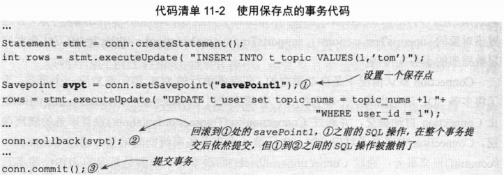
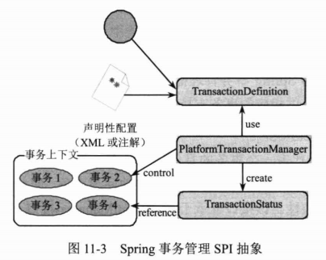

# Spring的事务管理 #

## 数据库事务基础知识 ##

### 何为事务 ###

就是多个SQL语句，要么所有执行成功，要么所有执行失败。

事务需满足4个特性 ACID（酸性）

- 原子性Atomic 
- 一致性Consistency 事务操作成功后，数据库所处的状态和它的业务规则是一致的。
- 隔离性Isolation 在并发数据操作是，不同的事务拥有各自的数据空间，它们的操作不会对对方产生干扰。
- 持久性Durabiliy 一旦事务提交成功后，事务中所有的数据操作都必须被持久化到数据库中。

在这些事务特性中，数据“一致性”是最终目标，其他特性都是为达到这个目标采取的措施、要求或手段。

数据库管理系统一般采用**重执行日志**来保证**原子性、一致性和持久性**。重执行日志记录了数据库变化的每一个动作，数据库在一个事务中执行一部分操作后发生错误退出，数据库即可根据重执行日志撤销已经执行的操作。此外，对于已经提交的事务，即使数据库崩溃，在重启数据库时也能够根据日志对尚未持久化的数据进行相应的重执行操作。

和Java程序采用对象锁机制进行线程同步类似，数据库管理采用**数据库锁机制**保证事务的**隔离性**。当多个事务视图对相同的数据进行操作时，只有持有锁的事务才能操作数据，直到前一个事务完成后，后面的事务才有机会对数据进行操作。

### 数据并发问题 ###

**脏读dirty read**

**A事务 读取 B事务 尚 未提交 的更改数据**，并在这个数据的基础上进行操作。若恰巧B事务回滚，那么A事务读到的数据根据是不被承认的。

---

**不可重复读unrepeatable read**

**A事务读取了B事务已经提交的更改数据**

---

**幻象读**

**A事务读取B事务提交的新增数据，这时A事务将出现幻象读的问题。**幻象读一般发生在计算**统计数据**的事务中。

---

**幻象读**和**不可重复读**是两个容易混淆的概念，前者是指读到了其他已经提交事务的**新增**数据，而后者是指读到了已经提交事务的更改数据（更改或删除）

为了避免这两种情况，采用的对策是不同的：防止读到更改数据，只需对操作的数据添加**行级锁**，阻止操作中的数据发生变化；而防止读到新增数据，则往往需要添加**表级锁**——将整张表锁定，防止新增数据

---

**第一类丢失更新**

**A事务撤销时，把已经提交的B事务的更新数据覆盖了。**

---

**第二类丢失更新**

**A事务覆盖B事务已经提交的数据，造成B事务所做的操作丢失**

### 数据库锁机制 ###

数据库通过锁机制解决并发访问的问题，虽然不同的数据库在实现细节上存在差别，但原理基本上是一样的。

根据锁的对象分类：

- 表锁定
- 行锁定

从并发事务锁定的关系上看

- 共享锁定
- 独占锁定

共享锁定会防止独占锁定，但允许其他的共享锁定。

而独占锁定既防止其他的独占锁定，也防止其他共享锁定。

### 事务隔离级别 ###

### JDBC对事务的支持 ###

并不是所有的数据库都支持事务，即使支持事务的数据库也并非所有的事务隔离级别。

## ThreadLocal基础知识 ##

模板类通过ThreadLocal解决线程安全的难题。

### 何为ThreadLocal ###

它是保存线程本地化对象的容器。

当运行于多线程环境的某个对象使用ThreadLocal维护变量时，ThreadLocal为每个使用该变量的线程分配一个独立的变量副本。

所以每个线程都可以独立地改变自己的副本，而不会影响其他线程所对应的副本。

从线程的角度看，这个变量就像线程专有的本地变量，这也是类名中“Local”所表达的意思。

**ThreadLocal简单实现版本**

**一个ThreadLocal实例**

### 与Thread同步机制的比较 ###

对于多线程资源共享的问题，同步机制采用了“**以时间换空间**”的方式：访问串行化，对象共享化；而Thread采用了“以空间换时间”的方式：访问并行化，对象独享化。

**前者**仅提供一份变量，让不同的线程排队访问；而**后者**为每个线程都提供了一份变量，因此可以同时访问而互不影响。

### Spring使用ThreadLocal解决线程安全问题 ###

无状态的Bean（没有域变量的类）可在多线程环境共享。

在Spring中，绝大部分Bean都可声明为singleton作用域。

Spring对一些Bean（如RequestContextHolder）中非线程安全的“状态性对象”采用ThreadLocal进行封装，让它们也成为线程安全的“状态对象”，因此，有状态的Bean就能够以singleton的方式在多线程中正常工作。

Spring对有状态Bean的改造思路

## Spring对事务管理的支持 ##

Spring深刻地认识到：大部分应用都是基于单数据源，只有为数不多的应用需要使用到多数据源的JTA事务。因此，在单数据源的情况下，Spring直接使用底层的数据源管理事务。

在面对多数据源的应用时，Spring才寻求JavaEE应用服务器支持，通过引用应用服务器中JNDI资源完成JTA事务。

### 事务管理关键抽象 ###

在Spring事务管理SPI(Service Provider Interface)的抽象层主要包括3个接口

- TransactionDefinition用于描述事务的1.隔离级别、2.超时时间、3.是否为只读和4.事务传播规则等控制事务具体行为的事务属性，这些事务属性可以通过XML配置或注解描述提供，也可以通过手工编程的方式设置。
- PlatformTransactionManager根据TransactionDefinition提供的事务属性配置信息创建事务，并用TransactionStatus描述这个激活事务的状态。

### Spring的事务管理器实现类 ###

PlatformTransactionManager接口的实现类

### 事务同步管理器 ###

Spring将JDBC的Connection、Hibernate的Session访问数据库的连接或会话对象统称为资源。

为了让DAO、Service类可能做到singleton，Spring 的事务同步管理器类org.springframework.transaction.support.**TransactionSynchronizationManager**使用ThreadLocal为不同事务线程提供了独立的资源副本，同时维护事务配置的属性和运行状态信息。

事务同步管理器是Spring事务管理的基石

不管用户使用的是编程式事务管理，还是声明式事务管理，都离不开事务同步管理器。

这些工具类提供静态方法获取当前线程绑定的资源

Spring为不同的持久化技术提供了模板类，模板类在内部通过资源获取工具类间间接访问TransactionSynchronizationManager中的线程绑定资源。

所以，如果DAO使用模板类进行持久化操作，这些DAO就可以配置成singleton。

若不使用模板类，也可以直接通过资源获取工具类访问线程相关的资源。

	public abstract class TransactionSynchronizationManager {
	
		private static final ThreadLocal<Map<Object, Object>> resources =
				new NamedThreadLocal<Map<Object, Object>>("Transactional resources");
	
		private static final ThreadLocal<Set<TransactionSynchronization>> synchronizations =
				new NamedThreadLocal<Set<TransactionSynchronization>>("Transaction synchronizations");
	
		private static final ThreadLocal<String> currentTransactionName =
				new NamedThreadLocal<String>("Current transaction name");
	
		private static final ThreadLocal<Boolean> currentTransactionReadOnly =
				new NamedThreadLocal<Boolean>("Current transaction read-only status");
	
		private static final ThreadLocal<Integer> currentTransactionIsolationLevel =
				new NamedThreadLocal<Integer>("Current transaction isolation level");
	
		private static final ThreadLocal<Boolean> actualTransactionActive =
				new NamedThreadLocal<Boolean>("Actual transaction active");

	。。。

TransactionSynchronizationManager将DAO、Service类中影响线程安全的所有“状态”统一抽取到该类中，并用ThreadLocal进行替换，从此DAO（必须是基于模板类或资源获取工具类创建的DAO）和Service（必须采用Spring事务管理机制）摘掉了非线程安全的帽子，完成了脱胎换骨的身份转变

### 事务传播行为 ###

在Spring管理的事务环境中，Service接口方法可能会在内部调用其他的Service接口方法以共同完成一个完整的业务操作，因此就会产生服务接口方法嵌套调用的情况，**Spring通过事务传播行为控制当前的事务如何传播到被嵌套嗲用的目标服务接口方法中**。

## 编程式事务管理 ##

org.springframework.transaction.support.TransactionTemplate

	@Service
	public class ForumService1 {
		public ForumDao forumDao;
		public TransactionTemplate template;
		
		public void addForum(final Forum forum) {
			
			template.execute(new TransactionCallbackWithoutResult() {
				protected void doInTransactionWithoutResult(TransactionStatus status) {
					forumDao.addForum(forum);
				}
			});
	
		}
	
		@Autowired
		public void setForumDao(ForumDao forumDao) {
			this.forumDao = forumDao;
		}
		@Autowired
		public void setTemplate(TransactionTemplate template) {
			this.template = template;
		}
	
	}

## 使用XML配置声明式事务 ##

这种方式对代码的侵入性最小，可让事务管理代码完全从业务代码中移除，非常符合非侵入式轻量级容器的理念。

Spring的声明式事务管理是通过Spring AOP实现，通过事务的声明性信息，Spring负责将事务管理增强逻辑动态织入业务方法的相应连接点中。这些逻辑包括获取线程绑定资源、开始事务、提交/回滚事务、进行异常转换和处理等工作。

### 一个将被实施事务增强的服务接口 ###

	@Service
	@Transactional
	public class BbtForum {
	    public ForumDao forumDao;
	
	    public TopicDao topicDao;
	
	    public PostDao postDao;
	
	    public void addTopic(Topic topic) throws Exception {
	        topicDao.addTopic(topic);
		//		if(true) throw new PessimisticLockingFailureException("fail");
	        postDao.addPost(topic.getPost());
	    }
	
	
	    @Transactional(readOnly = true)
	    public Forum getForum(int forumId) {
	        return forumDao.getForum(forumId);
	    }
	
	    public void updateForum(Forum forum) {
	        forumDao.updateForum(forum);
	    }
	
	    public int getForumNum() {
	        return forumDao.getForumNum();
	    }

### 使用原始的TransactionProxyFactoryBean ###

[声明式事务配置](src/main/resources/applicationContext-pfb.xml)

### 基于tx/aop命名空间的配置 ###

[tx/aop命名空间](src/main/resources/applicationContext-tx.xml)

基于tx/aop命名空间的配置是最常用的，它的表达能力最强且使用最为灵活。

## 使用注解配置声明式事务 ##

@Transactional 修饰类或方法

[使事务注解生效](src/main/resources/applicationContext-anno.xml)

## 集成特定的应用服务器 ##

### BEA WebLogic ###

### WebSphere ###

